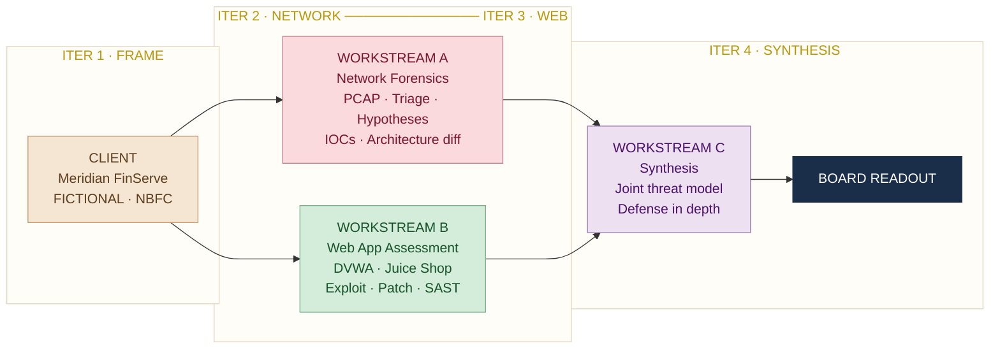

# 🛡️ Project KaVacH: Two-Surface Security Assessment


🎓 **PG Certificate Program — IIT Roorkee × Futurense Technologies**
Capstone Security Engagement · Cohort 2025

## 00. Overview & Architecture

Project KaVacH is a comprehensive, multi-surface security evaluation combining network forensics and web application security testing. The engagement is modeled against a real-world infrastructure scenario to identify attack vectors, validate architectural flaws, and build unified, data-backed remediation defenses.

---

### Client Profile

| Field | Detail |
| :--- | :--- |
| **Target Organization** | Meridian FinServe Pvt. Ltd. *(Fictional mid-sized Indian NBFC)* |
| **Operations** | Headquartered in Mumbai · 720 employees · 9 cities · 180,000 borrowers · 22,000 merchants |
| **Core Infrastructure** | Customer-facing lending/EMI portal, partner onboarding portal, branch office flows, public cloud footprints, and co-located data centers |

### Engagement Triggers

1. **Network Anomaly:** Anomalous east-west and outbound traffic flows detected over a 72-hour window inside a historically quiet server segment.
2. **Coordinated Web Disclosure:** Coordinated bug-bounty reporting indicating high-severity vulnerabilities (SQL Injection and IDOR) exposed on the customer application portals.

### The Engagement Architecture

Three workstreams run in parallel and converge into a single board-level readout. Workstreams A and B run from Iteration 2; Workstream C synthesises both in Iteration 4.



*Figure 01 — Three workstreams converge into a single board-level readout*

---

## 01. Engagement Objectives & Scope

The final success criteria mandates that an independent reader can fully reconstruct what was discovered, trace the logical chain of evidence, and deploy identical fixes within 15 minutes.

### In-Scope Deliverables

| Workstream | Scope |
| :--- | :--- |
| **Workstream A — Network Forensics** | 72-hour packet capture triage, hypothesis execution, confidence-scored IOC matrices, and network architecture diffs |
| **Workstream B — Web App Assessment** | Stand up testing environments, demonstrate exploits over a minimum of 5 OWASP Top 10 categories, produce source patches, and review automated SAST report shifts |
| **Workstream C — Synthesis** | Comprehensive cross-surface STRIDE threat model and a multi-layered Defense-in-Depth framework mapping back to specific technical findings |

---

## 02. Team & Responsibility Matrix

| Team Member | Role | Workstream Ownership | LinkedIn |
| :--- | :--- | :--- | :--- |
| **Megha Sharma** | Network Forensics Lead & Web App Co-Lead | **[WS-A: Network Forensics](https://github.com/dc15jan-ux/MKavach/tree/main/1.Network)** ✅ *(Complete)* · **[WS-B: Web App Assessment](https://github.com/dc15jan-ux/MKavach/tree/main/2.Webapp)** *(Co-Owner)* | [🔗 LinkedIn](https://www.linkedin.com/in/megha-sharma-82b5601a/) |
| **Vinay Kumar** | Web Application Security Lead | **[WS-B: Web App Assessment](https://github.com/dc15jan-ux/MKavach/tree/main/2.Webapp)** *(Co-Owner)* | [🔗 LinkedIn](https://www.linkedin.com/in/vinayhereon/) |
| **Kedar Pavaskar** | Threat Modelling Lead | **[WS-C: Synthesis & Threat Modelling](https://github.com/dc15jan-ux/MKavach/tree/main/3.%20Synthesis)** | [🔗 LinkedIn](https://www.linkedin.com/in/kedarpavaskar/) |

---

## 03. Repository Directory Structure

Every phase of execution adheres strictly to this modular framework to ensure immediate reproducibility.

```text
MKavach/
├── README.md                                         ← Engagement charter & change log
│
├── 1.Network/                                        ← Workstream A: Network Forensics
│   ├── A.1 Pcap Selection/
│   │   └── A1-source-pcap selection.md
│   ├── A.2 Triage/
│   │   ├── 1.triage-wireshark.md
│   │   ├── 2.triage-tshark.md
│   │   └── Evidences/
│   ├── A.3 Hypothesis-Driven Deep Dive/
│   │   └── Hypotheses.md
│   ├── A.4 Indicator Extraction/
│   │   └── iocs.csv
│   ├── A.5 Architecture Proposal/
│   │   ├── 1.before.svg
│   │   ├── 2.after.svg
│   │   └── 3.architecture.md
│   ├── A.6 Data Exfiltration and C2 Beaconing/
│   │   └── C2 Beaconing & Data Exfiltration.md
│   ├── A.7 Data Exfiltration Engine (Application)/
│   │   ├── 1. Exfil & C2 Detection Engine.md
│   │   └── 2. Exfil_C2_Beaconing_Detection.py
│   └── A.8 Report_Workstream_A/
│       └── report.md
│
├── 2.Webapp/                                         ← Workstream B: Web App Assessment
│   ├── B.1 Test Environment/
│   │   └── docker-compose.yml
│   ├── B.2 Findings/
│   │   ├── A01 Broken Access Control/
│   │   ├── A02 Cryptographic Failures/
│   │   ├── A03 Injection/
│   │   │   ├── 1.SQL Injection/
│   │   │   └── 2.XSS_Reflected/
│   │   ├── A04 Insecure Design/
│   │   └── A07 Identification and Authentication Failures/
│   ├── B.3 Attack Path documentation/
│   │   └── B3_Attack_Path_Documentation.md
│   └── B.4 SAST/
│       ├── 1.before.json
│       └── 2.after.json
│
├── 3. Synthesis/                                     ← Workstream C: Joint Threat Model
│   ├── C.1 Joint Threat Model/
│   │   ├── 1.threat-model.md
│   │   ├── 1a.Attack_Chain_1.md
│   │   ├── 1bAttack_Chain_2.md
│   │   └── 1c.Attack_Chain_3.md
│   ├── C.2 defense in depth proposal/
│   │   └── defence_in_depth.md
│   └── C.3 Executive Readout/
│       └── Executive_readout.pdf
│
├── 4. Prompts/                                       ← LLM Interaction Logs
│   ├── 1.workstream a LLM logs.md
│   └── 2.workstream-a-prompts.md
│
├── 5. Reflections/
│   └── 1.Reflections.md
│
└── 6. Retro/
    └── retro.md
```

---

## 04. Navigation — Workstream A: Network Forensics

> 72-hour PCAP triage · Hypothesis execution · IOC extraction · Architecture hardening

| Step | Deliverable | Link |
| :---: | :--- | :--- |
| A.1 | PCAP Source Selection | [A1-source-pcap selection.md](./1.Network/A.1%20Pcap%20Selection/A1-source-pcap%20selection.md) |
| A.2 | Triage — Wireshark | [1.triage-wireshark.md](./1.Network/A.2%20Triage/1.triage-wireshark.md) |
| A.2 | Triage — TShark | [2.triage-tshark.md](./1.Network/A.2%20Triage/2.%20triage-tshark.md) |
| A.3 | Hypothesis-Driven Deep Dive | [Hypotheses.md](./1.Network/A.3%20Hypothesis-Driven%20Deep%20Dive/Hypotheses.md) |
| A.4 | IOC Extraction (CSV) | [iocs.csv](./1.Network/A.4%20Indicator%20Extraction/iocs.csv) |
| A.5 | Architecture — Before | [1.before.svg](./1.Network/A.5%20Architecture%20Proposal/1.before.svg) |
| A.5 | Architecture — After | [2.after.svg](./1.Network/A.5%20Architecture%20Proposal/2.after.svg) |
| A.5 | Architecture Notes | [3.architecture.md](./1.Network/A.5%20Architecture%20Proposal/3.architecture.md) |
| A.6 | C2 Beaconing & Data Exfiltration | [C2 Beaconing & Data Exfiltration.md](./1.Network/A.6%20Data%20Exfiltration%20and%20C2%20Beaconing/C2%20Beaconing%20%26%20Data%20Exfiltration.md) |
| A.7 | Exfil Detection Engine (Writeup) | [Exfil & C2 Detection Engine.md](./1.Network/A.7%20Data%20Exfiltration%20Engine%20%28Application%29/1.%20Exfil%20%26%20C2%20Detection%20Engine.md) |
| A.7 | Exfil Detection Script (Python) | [Exfil_C2_Beaconing_Detection.py](./1.Network/A.7%20Data%20Exfiltration%20Engine%20%28Application%29/2.%20Exfil_C2_Beaconing_Detection.py) |
| A.8 | **Workstream A Final Report** | [report.md](./1.Network/A.8%20Report_Workstream_A/report%20.md) |

---

## 05. Navigation — Workstream B: Web Application Assessment

> DVWA · OWASP Juice Shop · 5+ OWASP Top 10 categories · SAST before/after

| Step | OWASP Category | Deliverable | Link |
| :---: | :--- | :--- | :--- |
| B.1 | Environment Setup | Docker Compose | [docker-compose.yml](./2.Webapp/B.1%20Test%20Environment/docker-compose.yml) |
| B.2 | **A01** Broken Access Control | Finding Report | [A-01_Broken_Access_Control.md](./2.Webapp/B.2%20Findings/A01%20Broken%20Access%20Control/A-01_Broken_Access_Control.md) |
| B.2 | **A02** Cryptographic Failures | Low Level | [1.DVWA Low Level.md](./2.Webapp/B.2%20Findings/A02%20Cryptographic%20Failures/1.DVWA%20Low%20Level.md) |
| B.2 | **A02** Cryptographic Failures | Medium Level | [2.DVWA Medium Level.md](./2.Webapp/B.2%20Findings/A02%20Cryptographic%20Failures/2.DVWA%20Medium%20Level.md) |
| B.2 | **A03** SQL Injection | Finding Report | [1.SQL Injection.md](./2.Webapp/B.2%20Findings/A03%20Injection/1.SQL%20Injection/1.SQL%20Injection.md) |
| B.2 | **A03** Reflected XSS | Finding Report | [1.Reflected_XSS.md](./2.Webapp/B.2%20Findings/A03%20Injection/2.XSS_Reflected/1.Reflected_XSS.md) |
| B.2 | **A04** Insecure Design | Finding Report | [A04 Insecure Design Findings.md](./2.Webapp/B.2%20Findings/A04%20Insecure%20Design/1.A04%20Insecure%20Design%20Findings.md) |
| B.2 | **A07** Auth Failures | Finding Report | [A07 Auth Failures Findings.md](./2.Webapp/B.2%20Findings/A07%20Identification%20and%20Authentication%20Failures/1.A07%20Identification%20and%20Authentication%20Failures%20Findings.md) |
| B.3 | Attack Path Documentation | Full chain | [B3_Attack_Path_Documentation.md](./2.Webapp/B.3%20Attack%20Path%20documentation/B3_Attack_Path_Documentation.md) |
| B.4 | SAST — Before | JSON baseline | [1.before.json](./2.Webapp/B.4%20SAST/1.before.json) |
| B.4 | SAST — After | JSON post-patch | [2.after.json](./2.Webapp/B.4%20SAST/2.after.json) |

---

## 06. Navigation — Workstream C: Synthesis

> Cross-surface STRIDE threat model · Defense-in-Depth · Executive Readout

| Step | Deliverable | Link |
| :---: | :--- | :--- |
| C.1 | Joint Threat Model | [1.threat-model.md](./3.%20Synthesis/C.1%20Joint%20Threat%20Model/1.threat-model.md) |
| C.1 | [Chain 1 — Network Pivot via Web Compromise](./3.%20Synthesis/C.1%20Joint%20Threat%20Model/1a.Attack_Chain_1.md) | [1a.Attack_Chain_1.md](./3.%20Synthesis/C.1%20Joint%20Threat%20Model/1a.Attack_Chain_1.md) |
| C.1 | [Chain 2 — Web SQLi Enables Network Lateral Movement](./3.%20Synthesis/C.1%20Joint%20Threat%20Model/1bAttack_Chain_2.md) | [1bAttack_Chain_2.md](./3.%20Synthesis/C.1%20Joint%20Threat%20Model/1bAttack_Chain_2.md) |
| C.1 | [Chain 3 — Parallel Siege: Network Wins and Arms the Web Attack](./3.%20Synthesis/C.1%20Joint%20Threat%20Model/1c.Attack_Chain_3.md) | [1c.Attack_Chain_3.md](./3.%20Synthesis/C.1%20Joint%20Threat%20Model/1c.Attack_Chain_3.md) |
| C.2 | Defense-in-Depth Proposal | [defence_in_depth.md](./3.%20Synthesis/C.2%20defense%20in%20depth%20proposal/defence_in_depth.md) |
| C.3 | Executive Readout (PDF) | [Executive_readout.pdf](./3.%20Synthesis/C.3%20Executive%20Readout/Executive_readout.pdf) |

---

## 07. Supplementary

| Section | Deliverable | Link |
| :---: | :--- | :--- |
| Prompts | Workstream A — LLM Logs | [1.workstream a LLM logs.md](./4.%20Prompts/1.workstream%20a%20LLM%20logs.md) |
| Prompts | Workstream A — Prompt Log | [2.workstream-a-prompts.md](./4.%20Prompts/2.workstream-a-prompts.md) |
| Reflections | Post-engagement reflections | [1.Reflections.md](./5.%20Reflections/1.Reflections.md) |
| Retro | Keep · Stop · Start | [retro.md](./6.%20Retro/retro.md) |

---

## 08. Tooling Matrix

> All tools operate entirely under local hardware constraints using open-source utilities.

| Security Phase | Tools Used | Purpose |
| :--- | :--- | :--- |
| **Packet Capture Triage** | Wireshark, tshark, Zeek | PCAP analysis, protocol dissection, and network traffic parsing |
| **Vulnerability Target Interfaces** | DVWA, OWASP Juice Shop | Local target replication hosted entirely via Docker |
| **Interception & Probing** | Burp Suite Community, curl | Web request interception, proxy modification, and manual injection testing |
| **Static Analysis** | Semgrep CE | Detection of hardcoded flaws and insecure code paths via static review |
| **Modeling & Visualization** | Mermaid, Draw.io | Generating architecture diagrams, before-vs-after diffs, and timeline layouts |

---

## 09. Unified Project Agile Timeline

**Execution flows across 4 milestones bound to clear system exit parameters:**

| Iteration | Phase | Exit Criteria |
| :---: | :--- | :--- |
| 1 | **Frame** | Charter freeze, environment replication verified under 15 minutes, target PCAP validation |
| 2 | **Network** | TShark session filtering completed, structured IOC list generated, network segment mapping |
| 3 | **Web** | Full execution of exploit proofs, SAST metrics captured, source code patch remediation |
| 4 | **Synthesize** | Convergence into a single board readout, structural threat dependencies defined, retrospectives held |

---

> *Proprietary engagement framework created by Futurense AI Clinic in collaboration with IIT Roorkee × Futurense Technologies.*
