# A.5 — Architecture Proposal
**Project KAVACH · Workstream A · Network Forensics** <br>
**Client:** Meridian FinServe Pvt. Ltd. *(Fictional NBFC)* <br>
**PCAP:** `2021-05-26-Trickbot-infection-with-Cobalt-Strike.pcap`

---

## Diagram Files

| S.No | File | Description | Link |
|------|------|-------------|------|
| 1 | `before.mermaid` | Network As-Is — pre-incident topology | [before.mermaid](./before.mermaid) |
| 2 | `after.mermaid` | Proposed Hardened Architecture — post-PCAP controls | [after.mermaid](./after.mermaid) |

---

## Overview

This document presents Meridian FinServe's network architecture in three stages:

| S.No | Stage | What it shows |
|------|-------|---------------|
| 1 | **Before** | Network as-is — how Meridian existed before any incident analysis |
| 2 | **PCAP Analysis** | What the packet capture revealed — the attack chain, IOCs, frame evidence |
| 3 | **After** | Proposed hardened architecture — every control mapped to a PCAP finding |

> **The diff between Before and After is the deliverable.**
> The PCAP analysis is the evidence that justifies every change.

---

## 1. BEFORE — Network As-Is (Pre-Analysis)

> This diagram shows Meridian FinServe's network **as it stood before the incident was investigated** — a normal corporate topology with no known compromise. No attack labels. No findings. Just the architecture as Meridian's IT team would have drawn it.
>
> 📄 **Standalone file:** [before.mermaid](./before.mermaid)

**Key structural weaknesses visible even before analysis:**
- Single perimeter firewall — no layered defence
- Flat subnet — all internal hosts reachable from each other
- No east-west segmentation between workstations and servers
- Single log server with no centralised SIEM
- Branch offices connecting directly via VPN to HQ firewall

---

## 2. PCAP ANALYSIS — What the Capture Revealed

> Running the PCAP through Wireshark and tshark revealed a complete Trickbot + Cobalt Strike intrusion chain. The timeline below shows what happened, in order, with frame evidence.

**Capture window:** `2021-05-26 20:23:18 → 21:43:28 UTC` (80 min 9 sec · 26,644 frames)
**Internal domain:** `victorypunk.com`
**Infected workstation:** `DESKTOP-OG16DGY` · `10.5.26.132`
**Domain Controller:** `VICTORYPUNK-DC` · `10.5.26.4`

### Attack Chain — Interactive Timeline

> 🖱 **Drag** to pan · **Scroll** to zoom · **Drag timeline bar** to scroll horizontally

<!-- INTERACTIVE TIMELINE — render this HTML block in a browser or embed tool -->
<!-- See attack-timeline.html for the full interactive version -->

---

### Attack Chain — Static Mermaid Reference

```mermaid
timeline
    title Trickbot + Cobalt Strike Attack Chain — 2021-05-26
    section T+0 to T+110s
        Frame 1 · T+0s        : Capture starts
                               : Workstation gets DHCP lease
                               : Network appears normal
        Frame 791 · T+106s    : 🔴 First SYN to 37.228.70.134 port 443
                               : Cobalt Strike beacon initialises
                               : No SNI in TLS handshake
        Frame 818 · T+108s    : 🔴 Workstation queries api.ipify.org
                               : Malware checking its public IP
                               : Pre-exfiltration reconnaissance step
    section T+370s to T+484s
        Frame 2910 · T+370s   : 🔴 First data exfiltration
                               : POST 4911 bytes to 36.95.27.243
                               : URI = /rob87/DESKTOP-OG16DGY_.../90
                               : Machine name embedded in path
        Frame 3045 · T+391s   : 🔴 Same POST duplicated
                               : Backup C2 at 103.102.220.50
                               : Trickbot uses redundant C2 servers
        Frame 3052 · T+390s   : C2 disguised as image request
                               : GET /images/redbutton.png
                               : From 192.236.155.230
        Frame 10799 · T+484s  : 🔴 LATERAL MOVEMENT
                               : svcctl CreateService to DC 10.5.26.4
                               : PsExec-style remote code execution
                               : Scope = one host → entire domain
    section T+521s to T+811s
        Frame 10962 · T+522s  : 🔴 DC queries ipinfo.io/ip
                               : DC is now infected
                               : Running same IP recon as workstation
        Frame 13210 · T+783s  : 🔴 DC begins data exfiltration
                               : POST /tot108/VICTORYPUNK-DC_.../90
                               : 7 minutes after workstation — confirms
                               : lateral movement succeeded
        Frame 14878 · T+855s  : DC queries myexternalip.com/raw
                               : Second IP recon from DC
    section T+3784s to T+4809s
        Frame 23179 · T+3791s : 🔴 Secondary C2 channel opens
                               : DC sends 90+ GETs to antivirusupdaty.com
                               : /logo?hour=true at ~5.4s intervals
        Frame 23758 · T+4212s : 🔴 Bulk credential dump begins
                               : DC POSTs 16 batches to 5.199.162.3/as
                               : Harvested credentials sent in bulk
        Frame 26451 · T+4750s : Cobalt Strike beacon still running
                               : ~202s intervals maintained throughout
        Frame 26644 · T+4809s : Capture ends — intrusion still active
                               : 28 TLS sessions to 37.228.70.134 total
```



### MITRE ATT&CK Phase Mapping — Attack Timeline

| S.No | Frame | T+ (sec) | Event | MITRE Tactic | Technique ID | Cyber Kill Chain Phase |
|------|-------|----------|-------|-------------|-------------|----------------------|
| 1 | Frame 1 | T+0s | Capture starts · DHCP lease · network normal | — | — | Reconnaissance |
| 2 | Frame 791 | T+106s | First SYN to 37.228.70.134:443 · CS beacon · no SNI | Command & Control | T1071.001 | Command & Control |
| 3 | Frame 818 | T+108s | Workstation queries api.ipify.org · IP recon | Discovery | T1016 | Reconnaissance |
| 4 | Frame 2910 | T+370s | POST 4911 bytes to 36.95.27.243 · /rob87/DESKTOP…/90 | Exfiltration | T1041 | Actions on Objectives |
| 5 | Frame 3045 | T+391s | Same POST to backup C2 103.102.220.50 | Exfiltration | T1041 | Actions on Objectives |
| 6 | Frame 3052 | T+390s | C2 disguised as image · GET /images/redbutton.png | C2 Obfuscation | T1001 | Command & Control |
| 7 | Frame 10799 | T+484s | svcctl CreateService to DC 10.5.26.4 · Lateral movement | Lateral Movement | T1021.002 | Lateral Movement |
| 8 | Frame 10962 | T+522s | DC queries ipinfo.io/ip · DC is now infected | Discovery | T1016 | Reconnaissance |
| 9 | Frame 13210 | T+783s | DC begins exfiltration · /tot108/VICTORYPUNK-DC…/90 | Exfiltration | T1041 | Actions on Objectives |
| 10 | Frame 14878 | T+855s | DC queries myexternalip.com/raw · 2nd IP recon | Discovery | T1016 | Reconnaissance |
| 11 | Frame 23179 | T+3791s | Secondary C2 · antivirusupdaty.com · 90+ GETs ~5.4s | Command & Control | T1568 | Command & Control |
| 12 | Frame 23758 | T+4212s | Bulk credential dump · DC POSTs 16 batches → 5.199.162.3 | Credential Access | T1003 | Actions on Objectives |
| 13 | Frame 26451 | T+4750s | CS beacon still active · ~202s intervals | Command & Control | T1071.001 | Command & Control |
| 14 | Frame 26644 | T+4809s | Capture ends · intrusion still active · 28 TLS sessions | Persistence | T1543 | Persistence |

### IOCs Confirmed from PCAP

| S.No | Type | IOC | Category | Frame Evidence | Confidence |
|------|------|-----|----------|---------------|------------|
| 1 | IP | `37.228.70.134` | Cobalt Strike C2 | 791–26451 · ~202s beacon | High |
| 2 | IP | `192.236.155.230` | CS C2 + Exfil | 3049–19069 · 7.4 MB transfer | High |
| 3 | IP | `5.199.162.3` | Cobalt Strike C2 | 22990–26644 · /logo?hour=true | High |
| 4 | IP | `36.95.27.243` | Trickbot C2 Primary | 2895–13213 · rob87+tot108 | High |
| 5 | IP | `103.102.220.50` | Trickbot C2 Secondary | 3032–14663 · mirror of primary | High |
| 6 | IP | `10.5.26.4` | Lateral Movement Source | Frame 10799 svcctl | High |
| 7 | URI | `/rob87/DESKTOP-OG16DGY_.../90` | Data Exfiltration | Frame 2910 | High |
| 8 | URI | `/tot108/VICTORYPUNK-DC_.../90` | Data Exfiltration | Frame 13210 | High |
| 9 | URI | `/logo?hour=true` | CS Beacon URI | 23179–26639 | High |
| 10 | URI | `/as` | CS Staging | 23758–25525 | High |
| 11 | UA | `Winhttp 1/0` | Trickbot reporter | Frames 2910–14613 | High |
| 12 | UA | `WinHTTP loader/1.0` | Trickbot downloader | Frames 5599–17677 | High |
| 13 | UA | `Mozilla/5.0 (Linux; Android 7.0; Pixel C...)` | CS Malleable UA | 23179–26639 | High |
| 14 | DNS | `victorypunk.com` | Internal AD recon | 358 queries · frames 26–25751 | High |
| 15 | DNS | `antivirusupdaty.com` | Secondary C2 domain | Frame 23179+ | High |
| 16 | DNS | `api.ipify.org / ipinfo.io / myexternalip.com` | IP recon | Frames 818, 10962, 14878 | High |

### Three Confirmed Hypotheses

| S.No | Hypothesis | Verdict | Key Evidence |
|------|-----------|---------|-------------|
| 1 | Host beacons to C2 at 37.228.70.134 | ✅ Confirmed · High | ~202s intervals · zero SNI · 28 TLS ClientHellos · frames 791–26451 |
| 2 | Malware POSTs stolen data to external servers | ✅ Confirmed · High | Frame 2910 POST · machine ID in URI · 3-step IP recon frames 818, 10962, 14878 |
| 3 | Attacker moved laterally from workstation to DC | ✅ Confirmed · High | `svcctl` frame 10799 · DC infected 7 min after workstation · 1.79 MB SMB session |

---

## 3. AFTER — Proposed Hardened Architecture

> Every control below is directly motivated by a finding from the PCAP analysis above.
> This is not a generic security checklist — it is a point-by-point response to what the capture revealed.
>
> 📄 **Standalone file:** [after.mermaid](./after.mermaid)

| S.No | Control Added | Fixes | PCAP Evidence |
|------|--------------|-------|---------------|
| 1 | Egress allowlist — ports 80/443 only | Port 447 exfiltration channel | IOC: port 447 used for `antivirusupdaty.com` |
| 2 | Block C2 IPs at perimeter | C2 beaconing | IOCs: 5 confirmed C2 IPs |
| 3 | DNS Firewall | Secondary C2 domain + IP recon services | `antivirusupdaty.com` · frames 818, 10962, 14878 |
| 4 | VLAN 10/20/30 segmentation | Flat subnet lateral movement | Frame 10799 `svcctl` workstation → DC |
| 5 | East-west default-deny firewall | Direct SMB workstation → DC | 2,164 SMB packets workstation → DC |
| 6 | Jump host only path VLAN30→VLAN20 | Unrestricted internal access | All 5 other hosts reachable from workstation |
| 7 | MFA + PAM | No privileged access controls | DC compromised, LSASS dumped |
| 8 | Suricata — ~202s TLS beacon rule | C2 beaconing went undetected 80 min | H1 confirmed ~202s interval |
| 9 | Zeek + SIEM — svcctl alert | Lateral movement went undetected | Frame 10799 |
| 10 | SIEM — POST to external IP alert | Data exfiltration went undetected | Frames 2910, 13210 |
| 11 | CloudTrail + VPC Flow Logs | Cloud footprint dark | No visibility on AWS activity |

---

## Risk Reduction Summary

| S.No | Threat | Before | After | PCAP Evidence |
|------|--------|--------|-------|--------------|
| 1 | C2 beaconing | Undetected for 80 min | Blocked at perimeter + SIEM alert < 5 min | 28 TLS sessions · ~202s intervals |
| 2 | Lateral movement | Unrestricted SMB workstation → DC | East-west firewall blocks svcctl | Frame 10799 |
| 3 | Data exfiltration | Port 447 open · no alert | Port 447 blocked · SIEM POST alert | Frames 2910, 13210 |
| 4 | IP recon | ipify/ipinfo/myexternalip unrestricted | DNS firewall blocks all three | Frames 818, 10962, 14878 |
| 5 | DC compromise | DC on flat subnet with workstations | DC isolated in VLAN 20 | 5 other hosts also targeted |
| 6 | Detection time | ~80 minutes blind | Target < 5 minutes | No NDR/SIEM in before state |

---

## Implementation Effort

| S.No | Control | Effort | Trade-off |
|------|---------|--------|-----------|
| 1 | Egress allowlist + IP blocklist | **S** — days | May break legacy tools using non-standard ports |
| 2 | DNS Firewall | **S** — days | Overzealous rules can block legitimate lookups |
| 3 | Suricata + Zeek rules | **M** — weeks | Requires tuning to reduce false positives |
| 4 | SIEM pipeline | **M** — weeks | Ongoing alert fatigue management needed |
| 5 | VLAN 10/20/30 segmentation | **L** — months | Significant re-IP and switch reconfiguration |
| 6 | East-west firewall | **L** — months | Application teams must map all legitimate flows |
| 7 | MFA + PAM | **M** — weeks | User friction on privileged account workflows |
| 8 | Jump host | **M** — weeks | Adds one-hop latency for all admin access |

> **S** = Days (config change) · **M** = Weeks (tool deployment) · **L** = Months (architectural change)

--- 

## Implementation Roadmap

> Controls ordered by **severity first, then effort**. The highest-severity controls — those that directly stop active C2, exfiltration, and lateral movement — start on **Week 1 (May 15)**. Architectural changes that require re-IP and switch work follow in Phase 3.

### Severity & effort key

| S.No | Rating | Meaning |
|------|--------|---------|
| 1 | **CRITICAL** | Directly blocks a confirmed active attack vector from the PCAP |
| 2 | **HIGH** | Adds detection/prevention that would have caught the attack within 5 min |
| 3 | **MEDIUM** | Architectural hardening that removes entire attack surface categories |
| 4 | **S** (days) | Config change only — single maintenance window |
| 5 | **M** (weeks) | Tool deployment + tuning |
| 6 | **L** (months) | Architectural change requiring re-IP, regression testing, change freeze |

---

### Phase 1 — Quick wins · Week 1–2 (May 15–May 28)

*CRITICAL severity · effort S (days) · start immediately*

| S.No | Control | Severity | Effort | Starts | Duration | Fixes (PCAP) | MITRE | Trade-off |
|------|---------|----------|--------|--------|----------|--------------|-------|-----------|
| 1 | Block 5 C2 IPs at perimeter | **CRITICAL** | S | Week 1 | 2 days | 28 TLS sessions · frames 791–26451 | T1071.001 · T1041 | Attacker rotates IPs — maintain blocklist with threat feed |
| 2 | Egress allowlist ports 80/443 · block port 447 | **CRITICAL** | S | Week 1 | 3 days | Port 447 exfil channel · antivirusupdaty.com | T1041 · T1048 | Audit legacy tools using non-standard ports before enforcing |
| 3 | DNS Firewall — block C2 domain + IP recon services | **CRITICAL** | S | Week 2 | 3 days | antivirusupdaty.com · api.ipify.org · ipinfo.io · myexternalip.com | T1568 · T1016 | Start blocklist-only — no sinkhole until tuned |

---

### Phase 2 — Tool deployments · Week 3–8 (May 29–July 9)

*HIGH severity · effort M (weeks)*

| S.No | Control | Severity | Effort | Starts | Duration | Fixes (PCAP) | MITRE | Trade-off |
|------|---------|----------|--------|--------|----------|--------------|-------|-----------|
| 4 | Suricata IDS — beacon · svcctl · exfil rules | **HIGH** | M | Week 3 | 4 weeks | C2 undetected 80 min · frame 10799 | T1071.001 · T1021.002 · T1041 | 1 week post-deploy for FP tuning — test rules on PCAP first |
| 5 | Zeek + SIEM pipeline — conn · DNS · SMB logs | **HIGH** | M | Week 4 | 5 weeks | Lateral movement undetected · frames 2910, 13210 | T1021.002 · T1041 · T1003 | Define triage runbook before go-live to prevent alert fatigue |
| 6 | MFA + PAM for privileged accounts | **HIGH** | M | Week 5 | 4 weeks | DC compromised · LSASS dumped · frame 23758 | T1003 · T1078 | Phased rollout — admins first, then all staff · 8h session timeout |

---

### Phase 3 — Architectural changes · Week 9–20 (July 10–Oct 1)

*MEDIUM severity · effort L (months) · cannot be rushed — requires re-IP and regression testing*

| S.No | Control | Severity | Effort | Starts | Duration | Fixes (PCAP) | MITRE | Trade-off |
|------|---------|----------|--------|--------|----------|--------------|-------|-----------|
| 7 | VLAN 10/20/30 segmentation — DMZ · Servers · Endpoints | **MEDIUM** | L | Week 9 | 8 weeks | Flat subnet — frame 10799 workstation → DC · all 5 hosts reachable | T1021.002 · T1543 | Significant re-IP + switch reconfig · full flow audit required per VLAN |
| 8 | East-west firewall + jump host (VLAN30 → VLAN20 only) | **MEDIUM** | L | Week 13 | 8 weeks | 2,164 SMB packets workstation → DC · direct svcctl cross-VLAN | T1021.002 | All admin flows rerouted through jump host · adds one-hop latency |

---

### Gantt — visual schedule

```
Week →       W1    W2    W3    W4    W5    W6    W7    W8    W9   W10   W11   W12  W13-16 W17-20
May15 →      15    22    29  Jun5   12    19    26   Jul3   10    17    24   Aug1  Sep–   Oct–

1. Block C2 IPs      ████
2. Egress allowlist  ██████
3. DNS Firewall            ██████
4. Suricata IDS                  ████████████████
5. Zeek + SIEM                         ████████████████████
6. MFA + PAM                                 ████████████
7. VLAN segmentation                                        ████████████████████
8. East-west FW                                                          ████████████████████████
```

> ████ = active work · controls with the same colour on the Gantt above share a PCAP finding they jointly address

---

### Why this order?

| S.No | Reason | Controls |
|------|--------|---------|
| 1 | The 5 C2 IPs and port 447 are **known, confirmed IOCs** — blocking them stops an *active* attack pattern with zero architecture changes | 1, 2 |
| 2 | DNS Firewall eliminates the IP recon loop (api.ipify.org → ipinfo.io → myexternalip.com) that precedes every exfiltration event in the PCAP | 3 |
| 3 | Suricata/Zeek/SIEM turn the 80-minute blind spot into a < 5-minute alert — needed before VLAN work begins so there is visibility during the re-IP window | 4, 5 |
| 4 | MFA/PAM closes the privilege escalation path that let the DC get dumped | 6 |
| 5 | VLAN segmentation + east-west firewall are the most impactful long-term controls but require change freezes and cannot be rushed — sequenced last to avoid re-doing network design after tool deployments | 7, 8 |

*Project KAVACH · Workstream A · A.5 Architecture Proposal*
*Futurense AI Clinic × IIT Roorkee · June 2026*
