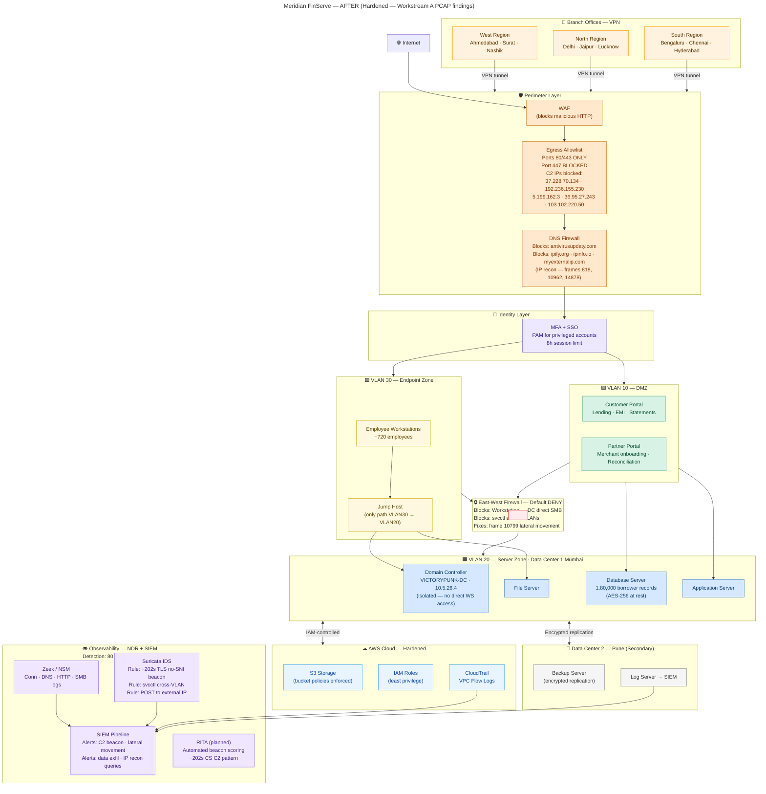

# A.5 — Architecture Proposal
**Project KAVACH · Workstream A · Network Forensics**
**Client:** Meridian FinServe Pvt. Ltd. *(Fictional NBFC)*
**PCAP:** `2021-05-26-Trickbot-infection-with-Cobalt-Strike.pcap`

---

## Diagram Files

| S.No | File | Description | Link |
|------|------|-------------|------|
| 1 | `before.mermaid` | Network As-Is — pre-incident topology | [before.mermaid](./before.mermaid) |
| 2 | `after.mermaid` | Proposed Hardened Architecture — post-PCAP controls | [after.mermaid](./after.mermaid) |

---

## Overview

This document presents Meridian FinServe's network architecture in three stages:

| S.No | Stage | What it shows |
|------|-------|---------------|
| 1 | **Before** | Network as-is — how Meridian existed before any incident analysis |
| 2 | **PCAP Analysis** | What the packet capture revealed — the attack chain, IOCs, frame evidence |
| 3 | **After** | Proposed hardened architecture — every control mapped to a PCAP finding |

> **The diff between Before and After is the deliverable.**
> The PCAP analysis is the evidence that justifies every change.

---

## 1. BEFORE — Network As-Is (Pre-Analysis)

> This diagram shows Meridian FinServe's network **as it stood before the incident was investigated** — a normal corporate topology with no known compromise. No attack labels. No findings. Just the architecture as Meridian's IT team would have drawn it.
>
> 📄 **Standalone file:** [before.mermaid](./before.mermaid)

**Key structural weaknesses visible even before analysis:**
- Single perimeter firewall — no layered defence
- Flat subnet — all internal hosts reachable from each other
- No east-west segmentation between workstations and servers
- Single log server with no centralised SIEM
- Branch offices connecting directly via VPN to HQ firewall

---

## 2. PCAP ANALYSIS — What the Capture Revealed

> Running the PCAP through Wireshark and tshark revealed a complete Trickbot + Cobalt Strike intrusion chain. The timeline below shows what happened, in order, with frame evidence.

**Capture window:** `2021-05-26 20:23:18 → 21:43:28 UTC` (80 min 9 sec · 26,644 frames)
**Internal domain:** `victorypunk.com`
**Infected workstation:** `DESKTOP-OG16DGY` · `10.5.26.132`
**Domain Controller:** `VICTORYPUNK-DC` · `10.5.26.4`

### Attack Chain — Interactive Timeline

> 🖱 **Drag** to pan · **Scroll** to zoom · **Drag timeline bar** to scroll horizontally

<!-- INTERACTIVE TIMELINE — render this HTML block in a browser or embed tool -->
<!-- See attack-timeline.html for the full interactive version -->

```html
<!DOCTYPE html>
<html lang="en">
<head>
<meta charset="UTF-8">
<title>Trickbot + Cobalt Strike — Attack Timeline</title>
<style>
  * { box-sizing: border-box; margin: 0; padding: 0; }
  body { font-family: 'Segoe UI', sans-serif; background: #0f1117; color: #e2e8f0; overflow: hidden; }
  #toolbar { display:flex; align-items:center; gap:12px; padding:10px 16px; background:#1a1d2e; border-bottom:1px solid #2d3148; }
  #toolbar h2 { font-size:14px; color:#a5b4fc; font-weight:600; flex:1; }
  .btn { padding:5px 12px; border-radius:6px; border:1px solid #3d4270; background:#252840; color:#c4caff; font-size:12px; cursor:pointer; }
  .btn:hover { background:#3d4270; }
  #canvas-wrap { width:100vw; height:calc(100vh - 48px); overflow:hidden; cursor:grab; position:relative; }
  #canvas-wrap.grabbing { cursor:grabbing; }
  svg { position:absolute; top:0; left:0; }
</style>
</head>
<body>
<div id="toolbar">
  <h2>🔴 Trickbot + Cobalt Strike Attack Chain — 2021-05-26 · PCAP Timeline</h2>
  <button class="btn" onclick="resetView()">⟳ Reset View</button>
  <button class="btn" onclick="zoomIn()">＋ Zoom</button>
  <button class="btn" onclick="zoomOut()">－ Zoom</button>
</div>
<div id="canvas-wrap" id="cv">
<svg id="svg" xmlns="http://www.w3.org/2000/svg"></svg>
</div>
<script>
const events = [
  { t:0,    frame:"Frame 1",     label:"Capture starts · DHCP lease · Network normal",               phase:"Reconnaissance",  tactic:"T1595",  kill:"Reconnaissance",   color:"#64748b" },
  { t:106,  frame:"Frame 791",   label:"🔴 First SYN → 37.228.70.134:443 · CS beacon init · No SNI", phase:"C2",              tactic:"T1071.001", kill:"C2",            color:"#ef4444" },
  { t:108,  frame:"Frame 818",   label:"🔴 api.ipify.org query · Malware checks public IP",           phase:"Reconnaissance",  tactic:"T1016",  kill:"Reconnaissance",   color:"#f97316" },
  { t:370,  frame:"Frame 2910",  label:"🔴 POST 4911 bytes → 36.95.27.243 · /rob87/DESKTOP…/90",     phase:"Exfiltration",    tactic:"T1041",  kill:"Actions on Obj",   color:"#dc2626" },
  { t:391,  frame:"Frame 3045",  label:"🔴 Same POST → backup C2 103.102.220.50 · Redundant C2",     phase:"Exfiltration",    tactic:"T1041",  kill:"Actions on Obj",   color:"#dc2626" },
  { t:390,  frame:"Frame 3052",  label:"C2 disguised as image · GET /images/redbutton.png",           phase:"C2",              tactic:"T1001",  kill:"C2",               color:"#a855f7" },
  { t:484,  frame:"Frame 10799", label:"🔴 LATERAL MOVEMENT · svcctl CreateService → DC 10.5.26.4",  phase:"Lateral Movement",tactic:"T1021.002", kill:"Lateral Move",  color:"#ff2222" },
  { t:522,  frame:"Frame 10962", label:"🔴 DC queries ipinfo.io/ip · DC is now infected",             phase:"Reconnaissance",  tactic:"T1016",  kill:"Reconnaissance",   color:"#f97316" },
  { t:783,  frame:"Frame 13210", label:"🔴 DC begins exfiltration · /tot108/VICTORYPUNK-DC…/90",     phase:"Exfiltration",    tactic:"T1041",  kill:"Actions on Obj",   color:"#dc2626" },
  { t:855,  frame:"Frame 14878", label:"DC queries myexternalip.com/raw · 2nd IP recon from DC",     phase:"Reconnaissance",  tactic:"T1016",  kill:"Reconnaissance",   color:"#f97316" },
  { t:3791, frame:"Frame 23179", label:"🔴 Secondary C2 · DC → antivirusupdaty.com 90+ GETs ~5.4s",  phase:"C2",              tactic:"T1568",  kill:"C2",               color:"#ef4444" },
  { t:4212, frame:"Frame 23758", label:"🔴 Bulk credential dump · DC POSTs 16 batches → 5.199.162.3",phase:"Credential Dump", tactic:"T1003",  kill:"Actions on Obj",   color:"#b91c1c" },
  { t:4750, frame:"Frame 26451", label:"CS beacon still running · ~202s intervals maintained",       phase:"C2",              tactic:"T1071.001", kill:"C2",            color:"#ef4444" },
  { t:4809, frame:"Frame 26644", label:"Capture ends · Intrusion still active · 28 TLS sessions",    phase:"Persistence",     tactic:"T1543",  kill:"Persistence",      color:"#64748b" },
];

const phaseColors = {
  "Reconnaissance":"#f97316","C2":"#ef4444","Exfiltration":"#dc2626",
  "Lateral Movement":"#ff2222","Credential Dump":"#b91c1c","Persistence":"#8b5cf6"
};

const CARD_W=320, CARD_H=110, ROW_H=150, PAD_LEFT=80, PAD_TOP=60, COL_GAP=360;
const maxT = 4809;

let svgEl = document.getElementById('svg');
let wrap  = document.getElementById('canvas-wrap');
let vx=0, vy=0, scale=1, dragging=false, startX, startY, startVX, startVY;

function buildSVG() {
  const cols = events.length;
  const W = PAD_LEFT + cols * COL_GAP + 200;
  const H = 500;
  svgEl.setAttribute('width',  W * scale);
  svgEl.setAttribute('height', H * scale);
  svgEl.setAttribute('viewBox', `0 0 ${W} ${H}`);

  let html = `<defs>
    <filter id="glow"><feGaussianBlur stdDeviation="3" result="cb"/><feMerge><feMergeNode in="cb"/><feMergeNode in="SourceGraphic"/></feMerge></filter>
  </defs>`;

  // Background
  html += `<rect width="${W}" height="${H}" fill="#0f1117"/>`;

  // Phase legend
  const phases = Object.keys(phaseColors);
  let lx = PAD_LEFT;
  phases.forEach(p => {
    html += `<rect x="${lx}" y="14" width="14" height="14" rx="3" fill="${phaseColors[p]}"/>`;
    html += `<text x="${lx+18}" y="25" font-size="11" fill="#cbd5e1">${p}</text>`;
    lx += p.length * 7 + 30;
  });

  // Axis line
  html += `<line x1="${PAD_LEFT}" y1="200" x2="${PAD_LEFT + (cols-1)*COL_GAP + 40}" y2="200" stroke="#334155" stroke-width="2"/>`;

  // Time markers on axis
  [0,500,1000,2000,3000,4000,4809].forEach(t => {
    const x = PAD_LEFT + (t / maxT) * ((cols-1) * COL_GAP);
    html += `<line x1="${x}" y1="195" x2="${x}" y2="205" stroke="#475569" stroke-width="1.5"/>`;
    html += `<text x="${x}" y="218" font-size="10" fill="#64748b" text-anchor="middle">T+${t}s</text>`;
  });

  events.forEach((ev, i) => {
    const cx = PAD_LEFT + i * COL_GAP;
    const above = i % 2 === 0;
    const cy = 200;
    const cardY = above ? 60 : 230;
    const lineY1 = above ? cardY + CARD_H : cy;
    const lineY2 = above ? cy : cardY;
    const col = ev.color;

    // Connector line
    html += `<line x1="${cx}" y1="${lineY1}" x2="${cx}" y2="${lineY2}" stroke="${col}" stroke-width="1.5" stroke-dasharray="4,3" opacity="0.7"/>`;

    // Dot on axis
    html += `<circle cx="${cx}" cy="${cy}" r="7" fill="${col}" filter="url(#glow)"/>`;
    html += `<circle cx="${cx}" cy="${cy}" r="4" fill="#0f1117"/>`;

    // Card
    html += `<rect x="${cx - CARD_W/2}" y="${cardY}" width="${CARD_W}" height="${CARD_H}" rx="8" fill="#1e2235" stroke="${col}" stroke-width="1.5"/>`;

    // Frame label
    html += `<text x="${cx}" y="${cardY+18}" font-size="11" font-weight="bold" fill="${col}" text-anchor="middle">${ev.frame} · T+${ev.t}s</text>`;

    // Main label (wrap at ~45 chars)
    const words = ev.label.split(' ');
    let line1='', line2='', line3='';
    let l=0;
    words.forEach(w => { if((line1+' '+w).trim().length<46){line1=(line1+' '+w).trim()}else if((line2+' '+w).trim().length<46){line2=(line2+' '+w).trim()}else{line3=(line3+' '+w).trim()} });
    if(line1) html += `<text x="${cx}" y="${cardY+34}" font-size="10.5" fill="#e2e8f0" text-anchor="middle">${line1}</text>`;
    if(line2) html += `<text x="${cx}" y="${cardY+48}" font-size="10.5" fill="#e2e8f0" text-anchor="middle">${line2}</text>`;
    if(line3) html += `<text x="${cx}" y="${cardY+62}" font-size="10.5" fill="#e2e8f0" text-anchor="middle">${line3}</text>`;

    // Phase badge
    html += `<rect x="${cx - CARD_W/2 + 8}" y="${cardY + CARD_H - 30}" width="${CARD_W/2 - 12}" height="20" rx="4" fill="${col}" opacity="0.2"/>`;
    html += `<text x="${cx - CARD_W/4 + 2}" y="${cardY + CARD_H - 17}" font-size="9.5" fill="${col}" font-weight="bold" text-anchor="middle">MITRE: ${ev.phase}</text>`;

    // Tactic
    html += `<rect x="${cx + 4}" y="${cardY + CARD_H - 30}" width="${CARD_W/2 - 12}" height="20" rx="4" fill="#334155"/>`;
    html += `<text x="${cx + CARD_W/4 - 2}" y="${cardY + CARD_H - 17}" font-size="9.5" fill="#94a3b8" text-anchor="middle">${ev.tactic} · ${ev.kill}</text>`;
  });

  svgEl.innerHTML = html;
  applyTransform();
}

function applyTransform() {
  svgEl.style.transform = `translate(${vx}px,${vy}px) scale(${scale})`;
  svgEl.style.transformOrigin = '0 0';
}

function resetView() { vx=0; vy=0; scale=1; applyTransform(); }
function zoomIn()  { scale = Math.min(scale*1.2, 3); applyTransform(); }
function zoomOut() { scale = Math.max(scale/1.2, 0.3); applyTransform(); }

wrap.addEventListener('mousedown', e => { dragging=true; startX=e.clientX; startY=e.clientY; startVX=vx; startVY=vy; wrap.classList.add('grabbing'); });
window.addEventListener('mousemove', e => { if(!dragging) return; vx=startVX+(e.clientX-startX); vy=startVY+(e.clientY-startY); applyTransform(); });
window.addEventListener('mouseup',   () => { dragging=false; wrap.classList.remove('grabbing'); });
wrap.addEventListener('wheel', e => { e.preventDefault(); const f = e.deltaY<0?1.1:0.9; scale=Math.min(3,Math.max(0.3,scale*f)); applyTransform(); }, {passive:false});

// Touch support
let lastTouchX, lastTouchY;
wrap.addEventListener('touchstart', e => { if(e.touches.length===1){lastTouchX=e.touches[0].clientX; lastTouchY=e.touches[0].clientY;} });
wrap.addEventListener('touchmove',  e => { if(e.touches.length===1){vx+=e.touches[0].clientX-lastTouchX; vy+=e.touches[0].clientY-lastTouchY; lastTouchX=e.touches[0].clientX; lastTouchY=e.touches[0].clientY; applyTransform(); e.preventDefault();} },{passive:false});

buildSVG();
</script>
</body>
</html>
```

### Attack Chain — Static Mermaid Reference

```mermaid
timeline
    title Trickbot + Cobalt Strike Attack Chain — 2021-05-26
    section T+0 to T+110s
        Frame 1 · T+0s        : Capture starts
                               : Workstation gets DHCP lease
                               : Network appears normal
        Frame 791 · T+106s    : 🔴 First SYN to 37.228.70.134 port 443
                               : Cobalt Strike beacon initialises
                               : No SNI in TLS handshake
        Frame 818 · T+108s    : 🔴 Workstation queries api.ipify.org
                               : Malware checking its public IP
                               : Pre-exfiltration reconnaissance step
    section T+370s to T+484s
        Frame 2910 · T+370s   : 🔴 First data exfiltration
                               : POST 4911 bytes to 36.95.27.243
                               : URI = /rob87/DESKTOP-OG16DGY_.../90
                               : Machine name embedded in path
        Frame 3045 · T+391s   : 🔴 Same POST duplicated
                               : Backup C2 at 103.102.220.50
                               : Trickbot uses redundant C2 servers
        Frame 3052 · T+390s   : C2 disguised as image request
                               : GET /images/redbutton.png
                               : From 192.236.155.230
        Frame 10799 · T+484s  : 🔴 LATERAL MOVEMENT
                               : svcctl CreateService to DC 10.5.26.4
                               : PsExec-style remote code execution
                               : Scope = one host → entire domain
    section T+521s to T+811s
        Frame 10962 · T+522s  : 🔴 DC queries ipinfo.io/ip
                               : DC is now infected
                               : Running same IP recon as workstation
        Frame 13210 · T+783s  : 🔴 DC begins data exfiltration
                               : POST /tot108/VICTORYPUNK-DC_.../90
                               : 7 minutes after workstation — confirms
                               : lateral movement succeeded
        Frame 14878 · T+855s  : DC queries myexternalip.com/raw
                               : Second IP recon from DC
    section T+3784s to T+4809s
        Frame 23179 · T+3791s : 🔴 Secondary C2 channel opens
                               : DC sends 90+ GETs to antivirusupdaty.com
                               : /logo?hour=true at ~5.4s intervals
        Frame 23758 · T+4212s : 🔴 Bulk credential dump begins
                               : DC POSTs 16 batches to 5.199.162.3/as
                               : Harvested credentials sent in bulk
        Frame 26451 · T+4750s : Cobalt Strike beacon still running
                               : ~202s intervals maintained throughout
        Frame 26644 · T+4809s : Capture ends — intrusion still active
                               : 28 TLS sessions to 37.228.70.134 total
```



### MITRE ATT&CK Phase Mapping — Attack Timeline

| S.No | Frame | T+ (sec) | Event | MITRE Tactic | Technique ID | Cyber Kill Chain Phase |
|------|-------|----------|-------|-------------|-------------|----------------------|
| 1 | Frame 1 | T+0s | Capture starts · DHCP lease · network normal | — | — | Reconnaissance |
| 2 | Frame 791 | T+106s | First SYN to 37.228.70.134:443 · CS beacon · no SNI | Command & Control | T1071.001 | Command & Control |
| 3 | Frame 818 | T+108s | Workstation queries api.ipify.org · IP recon | Discovery | T1016 | Reconnaissance |
| 4 | Frame 2910 | T+370s | POST 4911 bytes to 36.95.27.243 · /rob87/DESKTOP…/90 | Exfiltration | T1041 | Actions on Objectives |
| 5 | Frame 3045 | T+391s | Same POST to backup C2 103.102.220.50 | Exfiltration | T1041 | Actions on Objectives |
| 6 | Frame 3052 | T+390s | C2 disguised as image · GET /images/redbutton.png | C2 Obfuscation | T1001 | Command & Control |
| 7 | Frame 10799 | T+484s | svcctl CreateService to DC 10.5.26.4 · Lateral movement | Lateral Movement | T1021.002 | Lateral Movement |
| 8 | Frame 10962 | T+522s | DC queries ipinfo.io/ip · DC is now infected | Discovery | T1016 | Reconnaissance |
| 9 | Frame 13210 | T+783s | DC begins exfiltration · /tot108/VICTORYPUNK-DC…/90 | Exfiltration | T1041 | Actions on Objectives |
| 10 | Frame 14878 | T+855s | DC queries myexternalip.com/raw · 2nd IP recon | Discovery | T1016 | Reconnaissance |
| 11 | Frame 23179 | T+3791s | Secondary C2 · antivirusupdaty.com · 90+ GETs ~5.4s | Command & Control | T1568 | Command & Control |
| 12 | Frame 23758 | T+4212s | Bulk credential dump · DC POSTs 16 batches → 5.199.162.3 | Credential Access | T1003 | Actions on Objectives |
| 13 | Frame 26451 | T+4750s | CS beacon still active · ~202s intervals | Command & Control | T1071.001 | Command & Control |
| 14 | Frame 26644 | T+4809s | Capture ends · intrusion still active · 28 TLS sessions | Persistence | T1543 | Persistence |

### IOCs Confirmed from PCAP

| S.No | Type | IOC | Category | Frame Evidence | Confidence |
|------|------|-----|----------|---------------|------------|
| 1 | IP | `37.228.70.134` | Cobalt Strike C2 | 791–26451 · ~202s beacon | High |
| 2 | IP | `192.236.155.230` | CS C2 + Exfil | 3049–19069 · 7.4 MB transfer | High |
| 3 | IP | `5.199.162.3` | Cobalt Strike C2 | 22990–26644 · /logo?hour=true | High |
| 4 | IP | `36.95.27.243` | Trickbot C2 Primary | 2895–13213 · rob87+tot108 | High |
| 5 | IP | `103.102.220.50` | Trickbot C2 Secondary | 3032–14663 · mirror of primary | High |
| 6 | IP | `10.5.26.4` | Lateral Movement Source | Frame 10799 svcctl | High |
| 7 | URI | `/rob87/DESKTOP-OG16DGY_.../90` | Data Exfiltration | Frame 2910 | High |
| 8 | URI | `/tot108/VICTORYPUNK-DC_.../90` | Data Exfiltration | Frame 13210 | High |
| 9 | URI | `/logo?hour=true` | CS Beacon URI | 23179–26639 | High |
| 10 | URI | `/as` | CS Staging | 23758–25525 | High |
| 11 | UA | `Winhttp 1/0` | Trickbot reporter | Frames 2910–14613 | High |
| 12 | UA | `WinHTTP loader/1.0` | Trickbot downloader | Frames 5599–17677 | High |
| 13 | UA | `Mozilla/5.0 (Linux; Android 7.0; Pixel C...)` | CS Malleable UA | 23179–26639 | High |
| 14 | DNS | `victorypunk.com` | Internal AD recon | 358 queries · frames 26–25751 | High |
| 15 | DNS | `antivirusupdaty.com` | Secondary C2 domain | Frame 23179+ | High |
| 16 | DNS | `api.ipify.org / ipinfo.io / myexternalip.com` | IP recon | Frames 818, 10962, 14878 | High |

### Three Confirmed Hypotheses

| S.No | Hypothesis | Verdict | Key Evidence |
|------|-----------|---------|-------------|
| 1 | Host beacons to C2 at 37.228.70.134 | ✅ Confirmed · High | ~202s intervals · zero SNI · 28 TLS ClientHellos · frames 791–26451 |
| 2 | Malware POSTs stolen data to external servers | ✅ Confirmed · High | Frame 2910 POST · machine ID in URI · 3-step IP recon frames 818, 10962, 14878 |
| 3 | Attacker moved laterally from workstation to DC | ✅ Confirmed · High | `svcctl` frame 10799 · DC infected 7 min after workstation · 1.79 MB SMB session |

---

## 3. AFTER — Proposed Hardened Architecture

> Every control below is directly motivated by a finding from the PCAP analysis above.
> This is not a generic security checklist — it is a point-by-point response to what the capture revealed.
>
> 📄 **Standalone file:** [after.mermaid](./after.mermaid)

| S.No | Control Added | Fixes | PCAP Evidence |
|------|--------------|-------|---------------|
| 1 | Egress allowlist — ports 80/443 only | Port 447 exfiltration channel | IOC: port 447 used for `antivirusupdaty.com` |
| 2 | Block C2 IPs at perimeter | C2 beaconing | IOCs: 5 confirmed C2 IPs |
| 3 | DNS Firewall | Secondary C2 domain + IP recon services | `antivirusupdaty.com` · frames 818, 10962, 14878 |
| 4 | VLAN 10/20/30 segmentation | Flat subnet lateral movement | Frame 10799 `svcctl` workstation → DC |
| 5 | East-west default-deny firewall | Direct SMB workstation → DC | 2,164 SMB packets workstation → DC |
| 6 | Jump host only path VLAN30→VLAN20 | Unrestricted internal access | All 5 other hosts reachable from workstation |
| 7 | MFA + PAM | No privileged access controls | DC compromised, LSASS dumped |
| 8 | Suricata — ~202s TLS beacon rule | C2 beaconing went undetected 80 min | H1 confirmed ~202s interval |
| 9 | Zeek + SIEM — svcctl alert | Lateral movement went undetected | Frame 10799 |
| 10 | SIEM — POST to external IP alert | Data exfiltration went undetected | Frames 2910, 13210 |
| 11 | CloudTrail + VPC Flow Logs | Cloud footprint dark | No visibility on AWS activity |



---

## Risk Reduction Summary

| S.No | Threat | Before | After | PCAP Evidence |
|------|--------|--------|-------|--------------|
| 1 | C2 beaconing | Undetected for 80 min | Blocked at perimeter + SIEM alert < 5 min | 28 TLS sessions · ~202s intervals |
| 2 | Lateral movement | Unrestricted SMB workstation → DC | East-west firewall blocks svcctl | Frame 10799 |
| 3 | Data exfiltration | Port 447 open · no alert | Port 447 blocked · SIEM POST alert | Frames 2910, 13210 |
| 4 | IP recon | ipify/ipinfo/myexternalip unrestricted | DNS firewall blocks all three | Frames 818, 10962, 14878 |
| 5 | DC compromise | DC on flat subnet with workstations | DC isolated in VLAN 20 | 5 other hosts also targeted |
| 6 | Detection time | ~80 minutes blind | Target < 5 minutes | No NDR/SIEM in before state |

---

## Implementation Effort

| S.No | Control | Effort | Trade-off |
|------|---------|--------|-----------|
| 1 | Egress allowlist + IP blocklist | **S** — days | May break legacy tools using non-standard ports |
| 2 | DNS Firewall | **S** — days | Overzealous rules can block legitimate lookups |
| 3 | Suricata + Zeek rules | **M** — weeks | Requires tuning to reduce false positives |
| 4 | SIEM pipeline | **M** — weeks | Ongoing alert fatigue management needed |
| 5 | VLAN 10/20/30 segmentation | **L** — months | Significant re-IP and switch reconfiguration |
| 6 | East-west firewall | **L** — months | Application teams must map all legitimate flows |
| 7 | MFA + PAM | **M** — weeks | User friction on privileged account workflows |
| 8 | Jump host | **M** — weeks | Adds one-hop latency for all admin access |

> **S** = Days (config change) · **M** = Weeks (tool deployment) · **L** = Months (architectural change)

---

*Project KAVACH · Workstream A · A.5 Architecture Proposal*
*Futurense AI Clinic × IIT Roorkee · June 2026*
