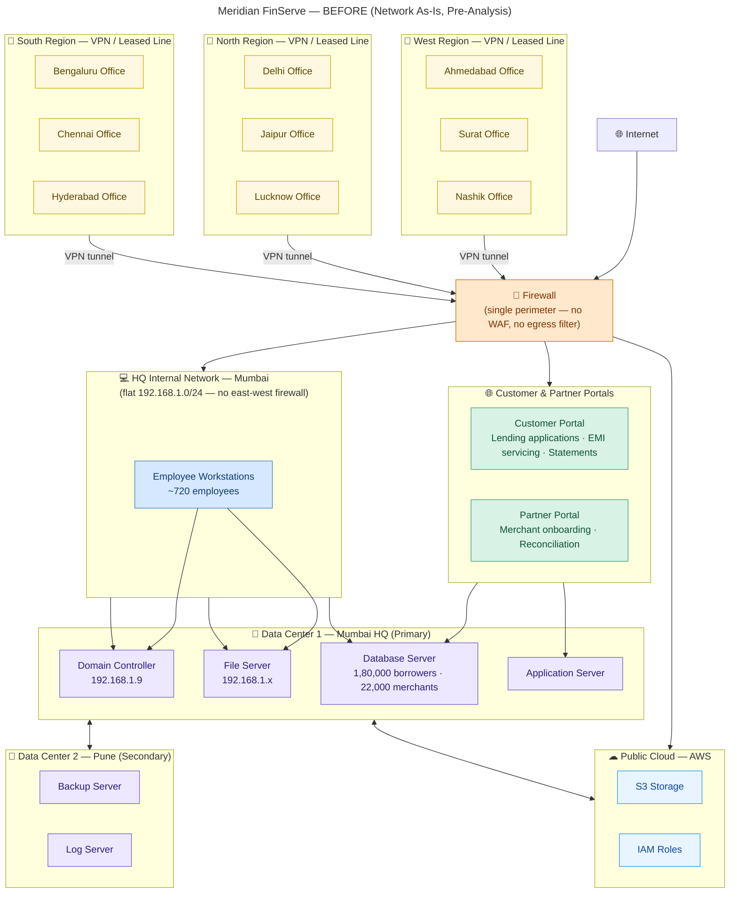
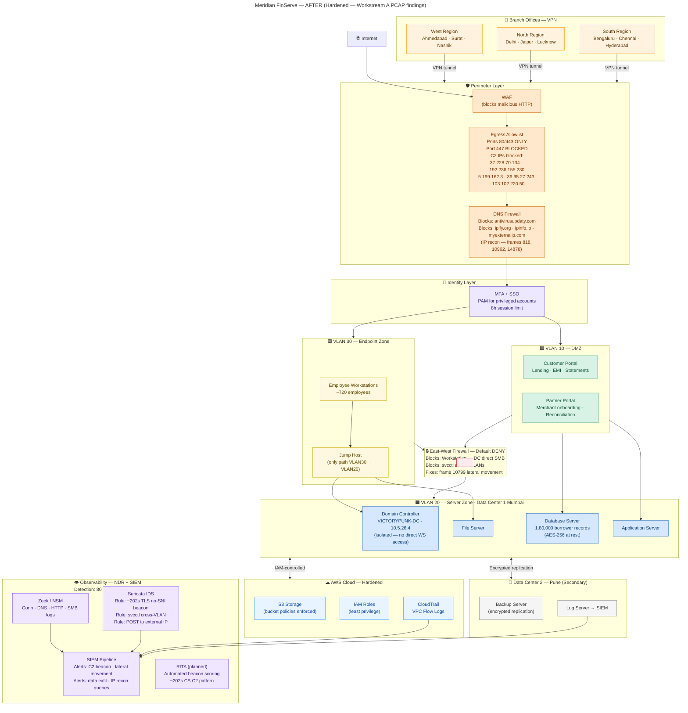

# A.5 — Architecture Proposal
**Project KAVACH · Workstream A · Network Forensics**
**Client:** Meridian FinServe Pvt. Ltd. *(Fictional NBFC)*
**PCAP:** `2021-05-26-Trickbot-infection-with-Cobalt-Strike.pcap`

---

## Overview

This document presents Meridian FinServe's network architecture in three stages:

| Stage | What it shows |
|-------|---------------|
| **Before** | Network as-is — how Meridian existed before any incident analysis |
| **PCAP Analysis** | What the packet capture revealed — the attack chain, IOCs, frame evidence |
| **After** | Proposed hardened architecture — every control mapped to a PCAP finding |

> **The diff between Before and After is the deliverable.**
> The PCAP analysis is the evidence that justifies every change.

---

## 1. BEFORE — Network As-Is (Pre-Analysis)

> This diagram shows Meridian FinServe's network **as it stood before the incident was investigated** — a normal corporate topology with no known compromise. No attack labels. No findings. Just the architecture as Meridian's IT team would have drawn it.

**Key structural weaknesses visible even before analysis:**
- Single perimeter firewall — no layered defence
- Flat subnet — all internal hosts reachable from each other
- No east-west segmentation between workstations and servers
- Single log server with no centralised SIEM
- Branch offices connecting directly via VPN to HQ firewall

---

## 2. PCAP ANALYSIS — What the Capture Revealed

> Running the PCAP through Wireshark and tshark revealed a complete Trickbot + Cobalt Strike intrusion chain. The timeline below shows what happened, in order, with frame evidence.

**Capture window:** `2021-05-26 20:23:18 → 21:43:28 UTC` (80 min 9 sec · 26,644 frames)
**Internal domain:** `victorypunk.com`
**Infected workstation:** `DESKTOP-OG16DGY` · `10.5.26.132`
**Domain Controller:** `VICTORYPUNK-DC` · `10.5.26.4`

### Attack Chain — Horizontal Timeline

```mermaid
timeline
    title Trickbot + Cobalt Strike Attack Chain — 2021-05-26
    section T+0 to T+110s
        Frame 1 · T+0s        : Capture starts
                               : Workstation gets DHCP lease
                               : Network appears normal
        Frame 791 · T+106s    : 🔴 First SYN to 37.228.70.134 port 443
                               : Cobalt Strike beacon initialises
                               : No SNI in TLS handshake
        Frame 818 · T+108s    : 🔴 Workstation queries api.ipify.org
                               : Malware checking its public IP
                               : Pre-exfiltration reconnaissance step
    section T+370s to T+484s
        Frame 2910 · T+370s   : 🔴 First data exfiltration
                               : POST 4911 bytes to 36.95.27.243
                               : URI = /rob87/DESKTOP-OG16DGY_.../90
                               : Machine name embedded in path
        Frame 3045 · T+391s   : 🔴 Same POST duplicated
                               : Backup C2 at 103.102.220.50
                               : Trickbot uses redundant C2 servers
        Frame 3052 · T+390s   : C2 disguised as image request
                               : GET /images/redbutton.png
                               : From 192.236.155.230
        Frame 10799 · T+484s  : 🔴 LATERAL MOVEMENT
                               : svcctl CreateService to DC 10.5.26.4
                               : PsExec-style remote code execution
                               : Scope = one host → entire domain
    section T+521s to T+811s
        Frame 10962 · T+522s  : 🔴 DC queries ipinfo.io/ip
                               : DC is now infected
                               : Running same IP recon as workstation
        Frame 13210 · T+783s  : 🔴 DC begins data exfiltration
                               : POST /tot108/VICTORYPUNK-DC_.../90
                               : 7 minutes after workstation — confirms
                               : lateral movement succeeded
        Frame 14878 · T+855s  : DC queries myexternalip.com/raw
                               : Second IP recon from DC
    section T+3784s to T+4809s
        Frame 23179 · T+3791s : 🔴 Secondary C2 channel opens
                               : DC sends 90+ GETs to antivirusupdaty.com
                               : /logo?hour=true at ~5.4s intervals
        Frame 23758 · T+4212s : 🔴 Bulk credential dump begins
                               : DC POSTs 16 batches to 5.199.162.3/as
                               : Harvested credentials sent in bulk
        Frame 26451 · T+4750s : Cobalt Strike beacon still running
                               : ~202s intervals maintained throughout
        Frame 26644 · T+4809s : Capture ends — intrusion still active
                               : 28 TLS sessions to 37.228.70.134 total
```

### IOCs Confirmed from PCAP

| Type | IOC | Category | Frame Evidence | Confidence |
|------|-----|----------|---------------|------------|
| IP | `37.228.70.134` | Cobalt Strike C2 | 791–26451 · ~202s beacon | High |
| IP | `192.236.155.230` | CS C2 + Exfil | 3049–19069 · 7.4 MB transfer | High |
| IP | `5.199.162.3` | Cobalt Strike C2 | 22990–26644 · /logo?hour=true | High |
| IP | `36.95.27.243` | Trickbot C2 Primary | 2895–13213 · rob87+tot108 | High |
| IP | `103.102.220.50` | Trickbot C2 Secondary | 3032–14663 · mirror of primary | High |
| IP | `10.5.26.4` | Lateral Movement Source | Frame 10799 svcctl | High |
| URI | `/rob87/DESKTOP-OG16DGY_.../90` | Data Exfiltration | Frame 2910 | High |
| URI | `/tot108/VICTORYPUNK-DC_.../90` | Data Exfiltration | Frame 13210 | High |
| URI | `/logo?hour=true` | CS Beacon URI | 23179–26639 | High |
| URI | `/as` | CS Staging | 23758–25525 | High |
| UA | `Winhttp 1/0` | Trickbot reporter | Frames 2910–14613 | High |
| UA | `WinHTTP loader/1.0` | Trickbot downloader | Frames 5599–17677 | High |
| UA | `Mozilla/5.0 (Linux; Android 7.0; Pixel C...)` | CS Malleable UA | 23179–26639 | High |
| DNS | `victorypunk.com` | Internal AD recon | 358 queries · frames 26–25751 | High |
| DNS | `antivirusupdaty.com` | Secondary C2 domain | Frame 23179+ | High |
| DNS | `api.ipify.org / ipinfo.io / myexternalip.com` | IP recon | Frames 818, 10962, 14878 | High |

### Three Confirmed Hypotheses

| # | Hypothesis | Verdict | Key Evidence |
|---|-----------|---------|-------------|
| H1 | Host beacons to C2 at 37.228.70.134 | ✅ Confirmed · High | ~202s intervals · zero SNI · 28 TLS ClientHellos · frames 791–26451 |
| H2 | Malware POSTs stolen data to external servers | ✅ Confirmed · High | Frame 2910 POST · machine ID in URI · 3-step IP recon frames 818, 10962, 14878 |
| H3 | Attacker moved laterally from workstation to DC | ✅ Confirmed · High | `svcctl` frame 10799 · DC infected 7 min after workstation · 1.79 MB SMB session |

---

## 3. AFTER — Proposed Hardened Architecture

> Every control below is directly motivated by a finding from the PCAP analysis above.
> This is not a generic security checklist — it is a point-by-point response to what the capture revealed.

| Control Added | Fixes | PCAP Evidence |
|--------------|-------|---------------|
| Egress allowlist — ports 80/443 only | Port 447 exfiltration channel | IOC: port 447 used for `antivirusupdaty.com` |
| Block C2 IPs at perimeter | C2 beaconing | IOCs: 5 confirmed C2 IPs |
| DNS Firewall | Secondary C2 domain + IP recon services | `antivirusupdaty.com` · frames 818, 10962, 14878 |
| VLAN 10/20/30 segmentation | Flat subnet lateral movement | Frame 10799 `svcctl` workstation → DC |
| East-west default-deny firewall | Direct SMB workstation → DC | 2,164 SMB packets workstation → DC |
| Jump host only path VLAN30→VLAN20 | Unrestricted internal access | All 5 other hosts reachable from workstation |
| MFA + PAM | No privileged access controls | DC compromised, LSASS dumped |
| Suricata — ~202s TLS beacon rule | C2 beaconing went undetected 80 min | H1 confirmed ~202s interval |
| Zeek + SIEM — svcctl alert | Lateral movement went undetected | Frame 10799 |
| SIEM — POST to external IP alert | Data exfiltration went undetected | Frames 2910, 13210 |
| CloudTrail + VPC Flow Logs | Cloud footprint dark | No visibility on AWS activity |

---

## Risk Reduction Summary

| Threat | Before | After | PCAP Evidence |
|--------|--------|-------|--------------|
| C2 beaconing | Undetected for 80 min | Blocked at perimeter + SIEM alert < 5 min | 28 TLS sessions · ~202s intervals |
| Lateral movement | Unrestricted SMB workstation → DC | East-west firewall blocks svcctl | Frame 10799 |
| Data exfiltration | Port 447 open · no alert | Port 447 blocked · SIEM POST alert | Frames 2910, 13210 |
| IP recon | ipify/ipinfo/myexternalip unrestricted | DNS firewall blocks all three | Frames 818, 10962, 14878 |
| DC compromise | DC on flat subnet with workstations | DC isolated in VLAN 20 | 5 other hosts also targeted |
| Detection time | ~80 minutes blind | Target < 5 minutes | No NDR/SIEM in before state |

---

## Implementation Effort

| Control | Effort | Trade-off |
|---------|--------|-----------|
| Egress allowlist + IP blocklist | **S** — days | May break legacy tools using non-standard ports |
| DNS Firewall | **S** — days | Overzealous rules can block legitimate lookups |
| Suricata + Zeek rules | **M** — weeks | Requires tuning to reduce false positives |
| SIEM pipeline | **M** — weeks | Ongoing alert fatigue management needed |
| VLAN 10/20/30 segmentation | **L** — months | Significant re-IP and switch reconfiguration |
| East-west firewall | **L** — months | Application teams must map all legitimate flows |
| MFA + PAM | **M** — weeks | User friction on privileged account workflows |
| Jump host | **M** — weeks | Adds one-hop latency for all admin access |

> **S** = Days (config change) · **M** = Weeks (tool deployment) · **L** = Months (architectural change)

---

*Project KAVACH · Workstream A · A.5 Architecture Proposal*
*Futurense AI Clinic × IIT Roorkee · June 2026*
