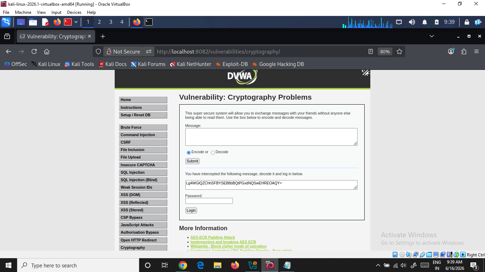
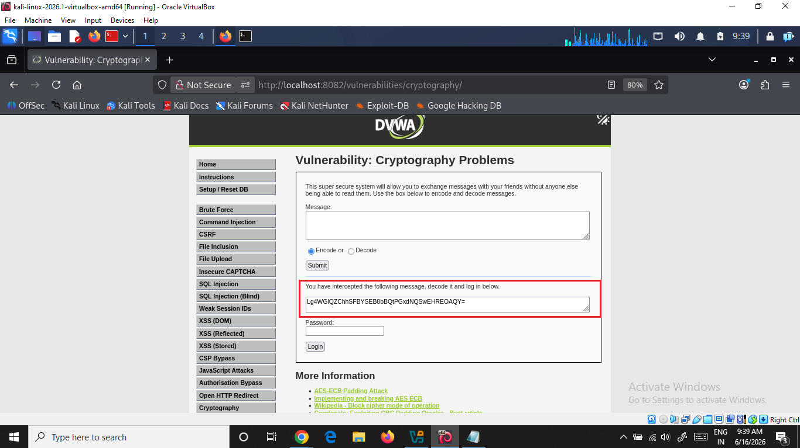
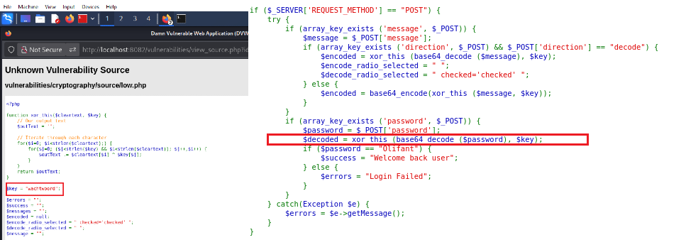
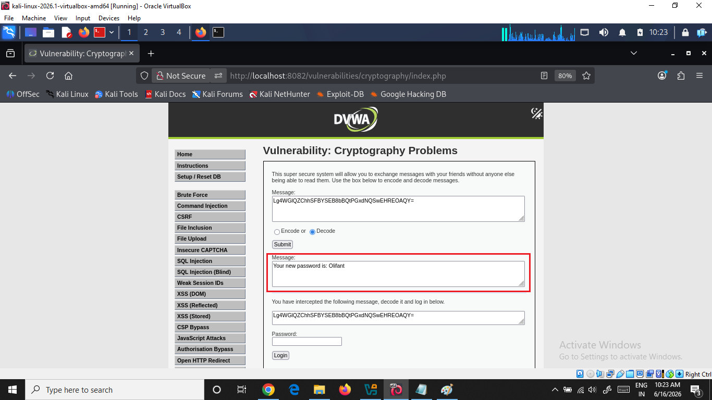
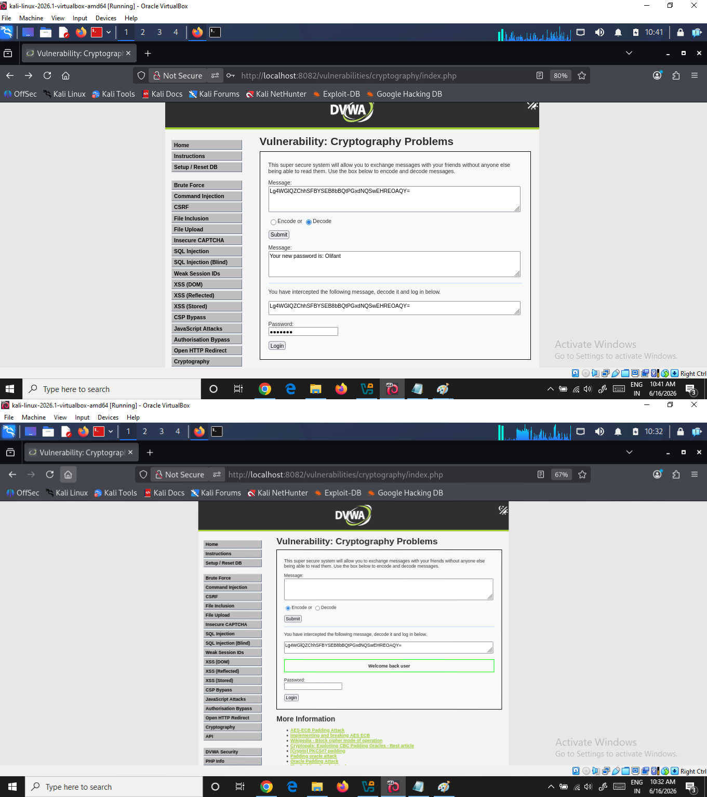

# Cryptographic Failures _Owasp_A02: Weak XOR-Based Message Encryption (DVWA – Low Security)

**Project:** KAVACH — Workstream B (Penetration Testing & Vulnerability Assessment)<br>
**Client (Fictional):** Meridian FinServe Pvt. Ltd.<br>
**Target Application:** DVWA — "Vulnerability: Cryptography Problems" module <br>
**Security Level Tested:** Low

---

## 1. Vulnerability Overview

- The module simulates a "secure messaging" feature that allows users to encode and decode messages, and includes an intercepted, encoded password that must be decrypted to log in.
- The encryption scheme used is a **custom repeating-key XOR cipher**, with the output additionally encoded in **Base64**.
- The encryption key is **hardcoded in the server-side source code** and is identical for every user/session.
- The login validation logic contains an additional **authentication bypass flaw**, independent of the weak cipher itself.

---

## 2. Vulnerability Classification

- **OWASP Top 10 (2021):** A02:2021 — Cryptographic Failures
- **CWE-327:** Use of a Broken or Risky Cryptographic Algorithm (custom XOR cipher instead of a vetted standard)
- **CWE-798:** Use of Hard-coded Credentials / Cryptographic Key
- **CWE-287:** Improper Authentication (login check ignores the decoded value entirely)

---

## 3. Environment Details

- **Lab URL:** `http://localhost:8082/vulnerabilities/cryptography/`
- **DVWA Security Level:** Low
- **Underlying Mechanism (from source code review via "View Source"):**
  - Encoding: `base64_encode(XOR(plaintext, key))`
  - Decoding: `XOR(base64_decode(ciphertext), key)`
  - Hardcoded key: `wachtwoord` (10-character static string)



---

## 4. Step-by-Step Exploitation

### Step 1 — Identify the Intercepted Message
- The application displays a pre-intercepted, Base64-encoded ciphertext that the "attacker" must decode:
  ```
  Lg4WGlQZChhSFBYSEB8bBQtPGxdNQSwEHREOAQY=
  ```



### Step 2 — Review Server-Side Source Code
- Using DVWA's "View Source" feature, the PHP implementation of the encode/decode logic and the hardcoded XOR key (`wachtwoord`) were obtained.



### Step 3 — Decode the Intercepted Message (via the application itself)
- Pasted the intercepted ciphertext into the message box, selected the **Decode** radio button, and clicked **Submit**.
- Equivalent `curl` request:
  ```bash
  curl -s -X POST "http://localhost:8082/vulnerabilities/cryptography/" \
    --cookie "PHPSESSID=<session_id>; security=low" \
    --data-urlencode "message=Lg4WGlQZChhSFBYSEB8bBQtPGxdNQSwEHREOAQY=" \
    --data-urlencode "direction=decode"
  ```
- **Response (decoded plaintext returned in the page):**
  ```
  Your new password is: Olifant
  ```



### Step 4 — Independently Verify via Python (Manual XOR)
- To validate the result without relying on the application, the same XOR/Base64 logic was re-implemented:
  ```python
  import base64

  key = "wachtwoord"
  ciphertext = "Lg4WGlQZChhSFBYSEB8bBQtPGxdNQSwEHREOAQY="

  decoded_bytes = base64.b64decode(ciphertext)
  plaintext = "".join(
      chr(b ^ ord(key[i % len(key)]))
      for i, b in enumerate(decoded_bytes)
  )
  print(plaintext)
  ```
- **Output:** `Your new password is: Olifant`

### Step 5 — Authenticate Using the Recovered Password
- Entered `Olifant` in the password field and clicked **Login**.
- Equivalent `curl` request:
  ```bash
  curl -s -X POST "http://localhost:8082/vulnerabilities/cryptography/" \
    --cookie "PHPSESSID=<session_id>; security=low" \
    --data-urlencode "password=Olifant"
  ```
- **Response:** `Welcome back user`



---

## 5. Root Cause Analysis

- **Custom, non-standard cryptographic algorithm:** A simple repeating-key XOR cipher was implemented in-house instead of using a vetted, industry-standard cryptographic library — violating the principle that custom cryptography should never be "rolled" by application developers.
- **Hardcoded, static encryption key:** The key `wachtwoord` is embedded directly in the server-side source code, identical across all users and sessions — anyone with access to the source (via leaked code, decompiled clients, or misconfigured repositories) immediately obtains the key.
- **XOR with a short, repeating key is trivially breakable:** Repeating-key XOR is vulnerable to frequency analysis and known-plaintext attacks even without knowledge of the key, especially for short keys and predictable message formats.
- **Sensitive data ("password") transmitted via reversible encoding rather than one-way hashing:** A password should never be recoverable in plaintext form by an observer; here, simple decoding fully reveals it.
- **Broken authentication logic (defense-in-depth failure):** The server computes the XOR-decoded value of the submitted password but never uses it — the actual check is a direct string comparison (`$password == "Olifant"`). This means the "encryption" layer can be bypassed entirely, independent of the cipher's weakness.

---

## 6. Business Impact on Meridian FinServe

- **Exposure of customer credentials and sensitive financial data:** If this pattern were used to "protect" account passwords, OTPs, transaction tokens, or account numbers in transit/storage, an attacker who intercepts traffic (e.g., via a compromised network segment or MITM position) could trivially recover plaintext values using a short Python script.
- **Single point of compromise — static key reuse:** Because one hardcoded key protects all users' data, a single source-code leak (e.g., an exposed Git repository, a decompiled mobile banking app, or an insider) would compromise the confidentiality of **every** customer's "encrypted" data simultaneously, not just one account.
- **Regulatory non-compliance:** Frameworks relevant to Meridian FinServe as a financial services provider (RBI cybersecurity guidelines, PCI-DSS for cardholder data, ISO 27001 cryptographic controls) explicitly require the use of approved, strong cryptographic algorithms (e.g., AES-256, RSA-2048+) with proper key management — a custom XOR scheme with a hardcoded key would constitute a direct audit finding and potential regulatory penalty.
- **Authentication bypass amplifies impact:** Even if the cipher were strengthened, the flawed login check means an attacker who simply guesses or social-engineers the plaintext password (without ever performing any cryptographic attack) can still authenticate — turning a "cryptography" weakness into a full **account takeover** vector.
- **Reputational and financial risk:** For a financial services firm, disclosure of a credential-recovery vulnerability of this nature could lead to fraudulent transactions, loss of customer trust, and costly incident response/remediation cycles.

---

## 7. Recommendations / Remediation

- **Eliminate custom cryptography:** Replace the XOR-based scheme with industry-standard, peer-reviewed implementations (e.g., AES-256-GCM for symmetric encryption via a well-maintained library such as libsodium or OpenSSL bindings).
- **Never hardcode cryptographic keys in source code:** Store keys in a dedicated secrets manager (e.g., HashiCorp Vault, AWS KMS, Azure Key Vault) with strict access controls and key rotation policies.
- **Use one-way hashing for passwords:** Passwords must be stored using a strong, salted hashing algorithm (e.g., bcrypt, Argon2) — never encrypted in a reversible form.
- **Fix authentication logic to actually use decoded/validated values:** Ensure server-side checks operate on the correctly processed credential, with no bypass paths via raw input comparison.
- **Conduct source code review and static analysis (SAST):** Integrate automated scanning to detect hardcoded secrets and weak cryptographic primitives before deployment.
- **Implement defense-in-depth:** Even with strong cryptography, enforce TLS for all data in transit, rate-limiting/lockout on authentication endpoints, and multi-factor authentication for sensitive operations.

---

## 8. Evidence Summary

| Item | Value |
|---|---|
| Intercepted Ciphertext | `Lg4WGlQZChhSFBYSEB8bBQtPGxdNQSwEHREOAQY=` |
| Hardcoded XOR Key | `wachtwoord` |
| Recovered Plaintext | `Your new password is: Olifant` |
| Recovered Password | `Olifant` |
| Login Result | `Welcome back user` |
