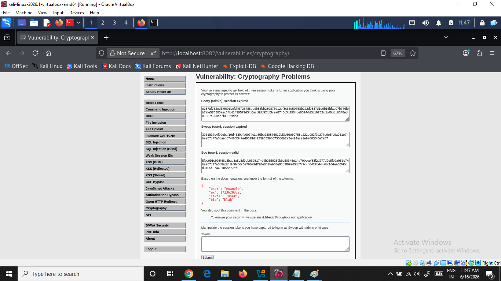
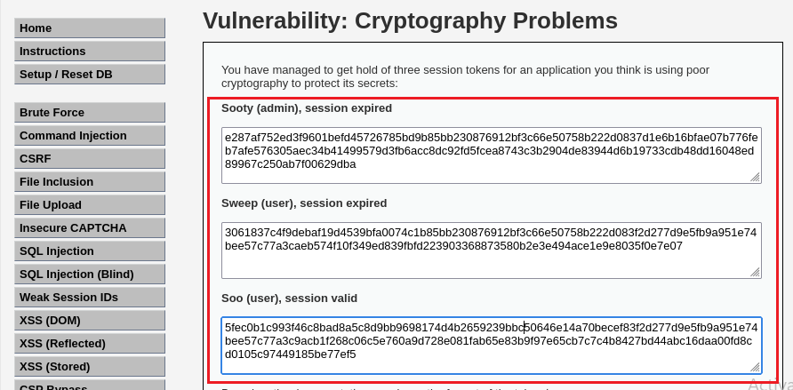
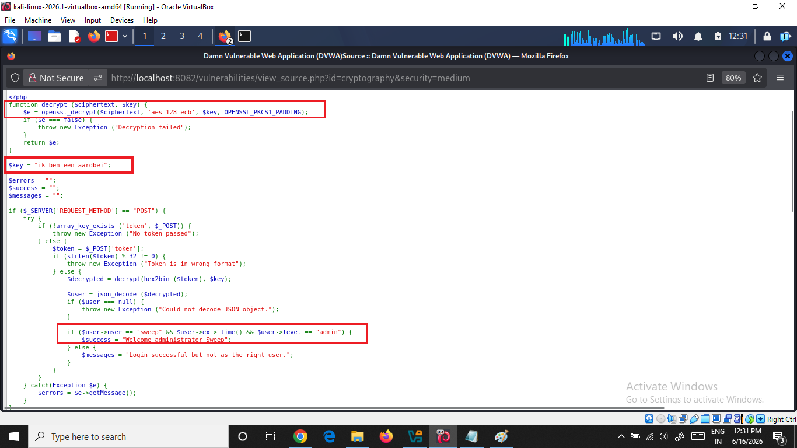
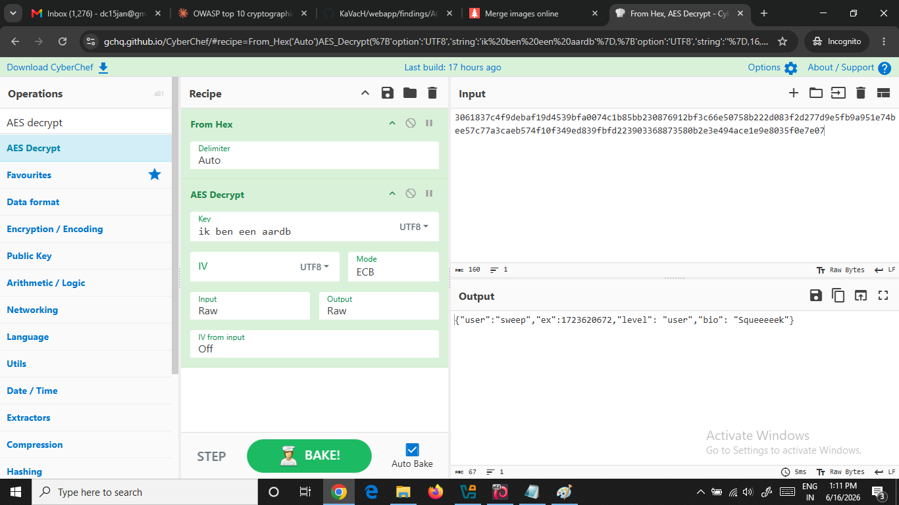
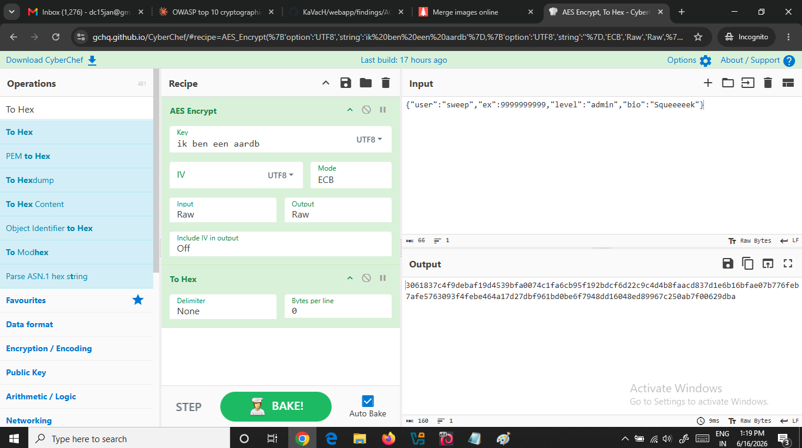
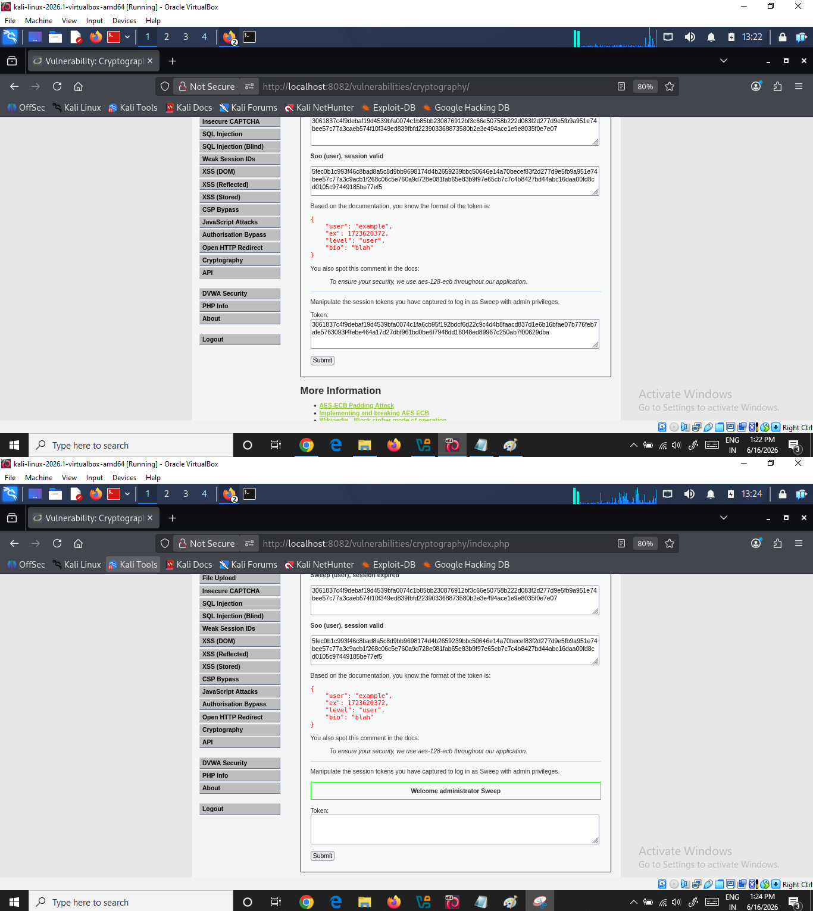

# DVWA — A02: Cryptographic Failures (Medium Level)

---

## 1. Vulnerability Information

| Field | Details |
|---|---|
| **Vulnerability** | A02 — Cryptographic Failures |
| **DVWA Module** | Cryptography Problems |
| **Security Level** | Medium |
| **Lab URL** | `http://localhost:8082/vulnerabilities/cryptography/` |
| **OWASP Category** | A02:2021 — Cryptographic Failures |

---

## 2. Goal

The goal of this exercise is to:

> **Log in as `Sweep` with admin privileges by manipulating encrypted session tokens.**

The application uses **AES-128-ECB** encryption with a **hardcoded key** to protect session tokens. Since ECB mode is weak and the key is exposed in the source code, we can:

1. Decrypt the intercepted session token of `Sweep`
2. Modify the JSON payload — change `level` to `admin` and set a future expiry time
3. Re-encrypt the modified token using the same key
4. Submit the forged token to gain admin access

---

## 3. Environment Details

- **Lab URL:** `http://localhost:8082/vulnerabilities/cryptography/`
- **DVWA Security Level:** Medium
- **Encryption Algorithm:** `AES-128-ECB`
- **Hardcoded Key (from View Source):** `ik ben een aardbei` *(truncated to 16 bytes → `ik ben een aardb`)*
- **Token Format (from documentation):**

```json
{
    "user": "example",
    "ex": 1723620372,
    "level": "user",
    "bio": "blah"
}
```



---

## 4. Difference Between Low and Medium Level

| Feature | Low Level | Medium Level |
|---|---|---|
| Encoding | XOR + Base64 | **AES-128-ECB** |
| Key | `wachtwoord` (plaintext) | `ik ben een aardbei` (hardcoded) |
| Key Location | Source code | Source code |
| Token Format | Base64 encoded | Hex encoded |
| Weakness | XOR is not encryption | ECB mode is weak + hardcoded key |

---

## 5. Step-by-Step Exploitation

---

### Step 1 — Identify the Intercepted Tokens

The application provides three intercepted session tokens:

- **Sooty (admin) — session expired**
```
e287af752ed3f9601befd45726785bd9b85bb230876912bf3c66e50758b222d0837d1e6b16bfae07b776feb7afe576305aec34b41499579d3fb6acc8dc92fd5fcea8743c3b2904de83944d6b19733cdb48dd16048ed89967c250ab7f00629dba
```

- **Sweep (user) — session expired**
```
3061837c4f9debaf19d4539bfa0074c1b85bb230876912bf3c66e50758b222d083f2d277d9e5fb9a951e74bee57c77a3caeb574f10f349ed839fbfd223903368873580b2e3e494ace1e9e8035f0e7e07
```

- **Soo (user) — session valid**
```
5fec0b1c993f46c8bad8a5c8d9bb9698174d4b2659239bbc50646e14a70becef83f2d277d9e5fb9a951e74bee57c77a3c9acb1f268c06c5e760a9d728e081fab65e83b9f97e65cb7c7c4b8427bd44abc16daa00fd8cd0105c97449185be77ef5
```


> **Why Sweep's token?** — The source code checks:
> ```php
> if ($user->user == "sweep" && $user->ex > time() && $user->level == "admin")
> ```
> So we need to forge **Sweep's token** with `level: admin` and a valid future expiry.


---

### Step 2 — Review Server-Side Source Code

Using DVWA's **"View Source"** feature, the PHP source code reveals:

```php
function decrypt($ciphertext, $key) {
    $e = openssl_decrypt($ciphertext, 'aes-128-ecb', $key, OPENSSL_PKCS1_PADDING);
    if ($e === false) {
        throw new Exception("Decryption failed");
    }
    return $e;
}

$key = "ik ben een aardbei";  // Hardcoded key — Cryptographic Failure!
```

**Key Finding — Success condition in source code:**

```php
if ($user->user == "sweep" && $user->ex > time() && $user->level == "admin") {
    $success = "Welcome administrator Sweep";
}
```

> ⚠️ **Hardcoded key in source code = A02 Cryptographic Failure**



---

### Step 3 — Decrypt Sweep's Token Using CyberChef

**Tool Used:** [CyberChef](https://gchq.github.io/CyberChef/)

**Recipe:**
```
1. From Hex   (Delimiter: Auto)
2. AES Decrypt
   Key: ik ben een aardb   ← 16 characters only (AES-128 needs 16 bytes)
   Key Type: UTF8
   Mode: ECB
   Input: Raw
   Output: Raw
```

**Input (Sweep's token):**
```
3061837c4f9debaf19d4539bfa0074c1b85bb230876912bf3c66e50758b222d083f2d277d9e5fb9a951e74bee57c77a3caeb574f10f349ed839fbfd223903368873580b2e3e494ace1e9e8035f0e7e07
```

**Output (Decrypted JSON):**
```json
{"user":"sweep","ex":1723620672,"level":"user","bio":"Squeeeeek"}
```



---

### Step 4 — Modify the JSON Payload

Two changes needed in the decrypted JSON:

| Field | Original Value | Modified Value | Reason |
|---|---|---|---|
| `level` | `"user"` | `"admin"` | Need admin privileges |
| `ex` | `1723620672` | `9999999999` | Original is expired — need future time |

**Modified JSON:**
```json
{"user":"sweep","ex":9999999999,"level":"admin","bio":"Squeeeeek"}
```

---

### Step 5 — Re-Encrypt the Modified Token Using CyberChef

**Recipe (Reverse of Step 3):**
```
1. AES Encrypt
   Key: ik ben een aardb   ← same 16 character key
   Key Type: UTF8
   Mode: ECB
   Input: Raw
   Output: Raw

2. To Hex
   Delimiter: None
```

**Input:**
```json
{"user":"sweep","ex":9999999999,"level":"admin","bio":"Squeeeeek"}
```

**Output (Forged Token):**
```
3061837c4f9debaf19d4539bfa0074c1fa6cb95f192bdcf6d22c9c4d4b8faacd837d1e6b16bfae07b776feb7afe5763093f4febe464a17d27dbf961bd0be6f7948dd16048ed89967c250ab7f00629dba
```



---

### Step 6 — Submit Forged Token to DVWA

1. Go to `http://localhost:8082/vulnerabilities/cryptography/`
2. Scroll down to the **Token** input field
3. Paste the forged token:
```
3061837c4f9debaf19d4539bfa0074c1fa6cb95f192bdcf6d22c9c4d4b8faacd837d1e6b16bfae07b776feb7afe5763093f4febe464a17d27dbf961bd0be6f7948dd16048ed89967c250ab7f00629dba
```
4. Click **Submit**
5. Result: ✅ `Welcome administrator Sweep`



---

## 6. Why This is an A02 Cryptographic Failure

| Vulnerability | Explanation |
|---|---|
| ⚠️ **AES-ECB Mode Used** | ECB encrypts each block independently — identical plaintext blocks produce identical ciphertext, making it weak and manipulable |
| ⚠️ **Hardcoded Key** | Key `ik ben een aardbei` is directly in source code — anyone with source access can decrypt all tokens |
| ⚠️ **No Token Integrity Check** | Server does not verify if token was tampered — forged token accepted without question |
| ⚠️ **Client-Side Token Trust** | Server blindly trusts token content — session data should be managed server-side |
| ⚠️ **Silent Key Truncation** | AES-128 key gets silently truncated from 18 to 16 bytes — unpredictable behavior |

---

## 7. Proof of Concept Summary

```
Target User      : Sweep
Original Level   : user (expired session)
Attack           : Decrypt token → Modify JSON → Re-encrypt → Submit
Forged Level     : admin
Forged Expiry    : 9999999999 (far future)
Final Result     : Welcome administrator Sweep ✅
```

---

## 8. Remediation

| Fix | Implementation |
|---|---|
| **Use AES-GCM instead of ECB** | GCM provides authentication + encryption together |
| **Never hardcode keys** | Store keys in environment variables or secrets vault |
| **Use server-side sessions** | Never trust client-supplied tokens for authorization |
| **Add token integrity check** | Use HMAC to sign tokens — detect any tampering |
| **Use signed JWT** | If using tokens, use properly signed JWT (RS256/HS256) |

### Secure Code Example:

```php
// WRONG — what DVWA does (Medium level)
$key = "ik ben een aardbei";           // hardcoded key!
openssl_decrypt($token, 'aes-128-ecb', $key);  // ECB mode — weak!

// CORRECT — what should be done
$key = getenv('APP_SECRET_KEY');        // key from environment variable
openssl_decrypt($token, 'aes-256-gcm', $key, 0, $iv, $tag);  // GCM with auth tag
```

---

## 9. References

- [OWASP A02:2021 — Cryptographic Failures](https://owasp.org/Top10/A02_2021-Cryptographic_Failures/)
- [AES-ECB Block Cipher Mode](https://en.wikipedia.org/wiki/Block_cipher_mode_of_operation#ECB)
- [Implementing and Breaking AES ECB](https://robertheaton.com/2013/07/29/padding-oracle-attack/)
- [CyberChef Tool](https://gchq.github.io/CyberChef/)
- [DVWA GitHub Repository](https://github.com/digininja/DVWA)
