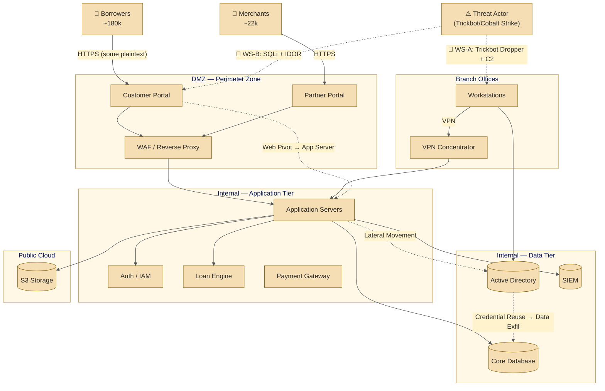

# PROJECT KAVACH — WORKSTREAM C
## STRIDE Threat Model: Meridian FinServe Pvt. Ltd.

| Field | Detail |
|---|---|
| **Document ID** | KAVACH-WC-TM-001 |
| **Version** | 1.1 |
| **Classification** | Restricted — Engagement Use Only |
| **Assessment Period** | June – July 2026 |
| **Analyst Role** | Workstream C — Threat Modelling Analyst |
| **Inputs** | KAVACH-WA (Network Forensics · PCAP), KAVACH-WB (Web Application Assessment), `architecture/1.before.mermaid` |

---

## 1. Purpose

Workstreams A and B each examined Meridian FinServe from a single surface. This workstream integrates them into **one cohesive system view**, highlighting attack chains that cross the **network forensics** and **web application** surfaces.

This document presents a **STRIDE-based threat model** that fully satisfies **C.1** requirements by treating Meridian FinServe as a single integrated system.

---

## 2. Architecture Overview (Baseline)

**See `architecture/1.before.mermaid`** for the current “As-Is” network and system architecture used as the baseline.

**Client Profile:** Meridian FinServe Pvt. Ltd. is a fictional mid-sized Indian NBFC headquartered in Mumbai with presence across nine cities. It offers SMB lending, merchant payments, and embedded credit products to ~180,000 borrowers and ~22,000 merchants.

**Key Components in Scope:**
- Customer Portal & Partner Portal (represented by DVWA + OWASP Juice Shop)
- Application Servers, Auth/IAM service, Loan Processing Engine, Payment Gateway
- Core Database, Active Directory, SIEM/Log Server, Backup Storage
- Branch offices connected via VPN, small public cloud footprint

---

## 3. STRIDE — Concept Note

**STRIDE** is a threat categorisation framework developed at Microsoft. It systematically identifies threats by asking structured questions for each system component.

| Category | Security Property Violated | What It Means |
|----------|----------------------------|---------------|
| **S**poofing | Authentication | Attacker impersonates a legitimate user or system |
| **T**ampering | Integrity | Data or code modified without authorisation |
| **R**epudiation | Non-repudiation | Actions cannot be attributed or logged |
| **I**nformation Disclosure | Confidentiality | Unauthorised access to data |
| **D**enial of Service | Availability | Legitimate users blocked |
| **E**levation of Privilege | Authorisation | Entity gains higher capabilities |

---

## 4. System Decomposition

### 4.1 External Entities

| ID | Entity | Description | Trust Level |
|----|--------|-------------|-------------|
| EE-01 | Borrowers | ~180,000 customers accessing portals | Untrusted |
| EE-02 | Merchants | ~22,000 partners | Semi-trusted |
| EE-03 | Branch Staff | ~720 employees via VPN | Trusted (internal) |
| EE-04 | Threat Actor | Trickbot/Cobalt Strike operator (from WS-A PCAP) | Hostile |
| EE-05 | Cloud Provider | AWS for storage/API integrations | Conditionally trusted |

### 4.2 Components

| ID | Component | Type |
|----|-----------|------|
| P-01 | Customer Portal | Web Application |
| P-02 | Partner Portal | Web Application |
| P-03 | Application Servers | Backend Logic / REST APIs |
| P-04 | Auth Service / IAM | Authentication, Session, RBAC |
| P-05 | Loan Processing Engine | Underwriting, Disbursement |
| P-06 | Payment Gateway | EMI Collection, Merchant Payouts |
| DS-01 | Core Database | Borrower PII, Loans, Transactions |
| DS-02 | Active Directory | Internal identities, Group Policy |
| DS-03 | SIEM / Log Server | Centralised security events |
| DS-04 | Cloud Storage | Statements, reports, archives |
| DS-05 | Backup Storage | DC1 / DC2 |

### 4.3 Trust Boundaries

| ID | Boundary | Description |
|----|----------|-------------|
| TB-1 | Internet → DMZ | External traffic entry point |
| TB-2 | DMZ → Internal App Tier | Protects core data tier |
| TB-3 | Internal → Branch / Cloud | **WS-A PCAP confirms traversal** during lateral movement |

---

## 5. Data Flow Diagram with Attack Paths

---

## 6. STRIDE Threat Register (Summary)

**Critical Risks** include SQLi/IDOR (WS-B), LSASS dumps & Pass-the-Hash (WS-A), and weak segmentation.

# 6.1 Customer Portal (WS-B Surface)

| ID | STRIDE Category | Threat | Evidence | Risk | MITRE ATT&CK |
|----|----------------|---------|----------|------|--------------|
| T-01 | Spoofing | Stolen session token replayed to impersonate borrower; no token rotation after login | WS-B A07 — Weak Session Management | CRITICAL | T1539 |
| T-02 | Tampering | Loan parameters modified in transit via IDOR | WS-B A01 — No server-side ownership check | HIGH | T1565 |
| T-03 | Repudiation | Portal logs no failed authentication attempts or IDOR probing | WS-B A01 — Missing access control logging | HIGH | T1562.006 |
| T-04 | Information Disclosure | Blind SQL Injection on login endpoint reveals database schema | WS-B A03 — Unparameterized query | CRITICAL | T1190 |
| T-05 | Information Disclosure | IDOR on `/api/statements/{account_id}` allows enumeration of borrower accounts | WS-B A01 | CRITICAL | T1213 |
| T-06 | Denial of Service | Unauthenticated endpoint accepts unbounded SQL queries | WS-B A03 + No Rate Limiting | MEDIUM | T1499 |
| T-07 | Elevation of Privilege | Stored XSS in partner form executes within admin context | WS-B A03 — Stored XSS | CRITICAL | T1059.007 |

---

# 6.2 Database Server (Both Surfaces)

| ID | STRIDE Category | Threat | Evidence | Risk | MITRE ATT&CK |
|----|----------------|---------|----------|------|--------------|
| T-08 | Spoofing | Shared database service account abused using harvested credentials | WS-B SQLi error exposes connection string | CRITICAL | T1078 |
| T-09 | Tampering | Attacker modifies loan records after obtaining database write access | WS-B — SQLi write capability | HIGH | T1565.001 |
| T-10 | Information Disclosure | Trickbot LSASS dump captures database service account hash | WS-A — Credential Access Phase | CRITICAL | T1003.001 |
| T-11 | Elevation of Privilege | Database service account holds sysadmin role, enabling `xp_cmdshell` RCE | WS-B SQLi + Least Privilege Violation | CRITICAL | T1505.001 |

---

# 6.3 Internal Network / Server Segment (WS-A Surface)

| ID | STRIDE Category | Threat | Evidence | Risk | MITRE ATT&CK |
|----|----------------|---------|----------|------|--------------|
| T-12 | Spoofing | Cobalt Strike Beacon masquerades as legitimate HTTPS traffic | WS-A — JA3 Fingerprint, Typosquatted C2 | CRITICAL | T1036 |
| T-13 | Tampering | Trickbot modifies Registry Run Keys for persistence | WS-A — Registry Artifacts in PCAP | HIGH | T1547.001 |
| T-14 | Repudiation | Fileless Cobalt Strike BOF operations reduce audit visibility | WS-A — In-memory Execution | HIGH | T1620 |
| T-15 | Information Disclosure | Anomalous east-west SMB traffic indicates Pass-the-Hash activity | WS-A — Lateral Movement | CRITICAL | T1550.002 |
| T-16 | Denial of Service | Aggressive C2 beaconing saturates internal bandwidth | WS-A — High-frequency Beacon Bursts | MEDIUM | T1498 |
| T-17 | Elevation of Privilege | LSASS dump enables Domain Admin compromise through Pass-the-Hash | WS-A — Lateral Movement to Domain Controller | CRITICAL | T1003 |

---

# 6.4 Active Directory (Shared Surface)

| ID | STRIDE Category | Threat | Evidence | Risk | MITRE ATT&CK |
|----|----------------|---------|----------|------|--------------|
| T-18 | Spoofing | Domain Administrator hash used for Pass-the-Hash authentication | WS-A — Credential Access | CRITICAL | T1550.002 |
| T-19 | Information Disclosure | DCSync attack retrieves all domain password hashes | WS-A — Post-Lateral Movement Activity | CRITICAL | T1003.006 |
| T-20 | Elevation of Privilege | Kerberoasting targets portal service accounts to obtain elevated access | WS-A + WS-B | HIGH | T1558.003 |

---

# Risk Summary

| Risk Level | Count |
|------------|--------|
| CRITICAL | 11 |
| HIGH | 7 |
| MEDIUM | 2 |
| LOW | 0 |

---

# Key Attack Chains

## Attack Chain 1: SQL Injection to Domain Compromise

1. Blind SQL Injection on Customer Portal (T-04)
2. Database Credential Exposure (T-08)
3. Database Service Account Abuse (T-11)
4. Credential Dumping from Internal Systems (T-10)
5. Pass-the-Hash Lateral Movement (T-15)
6. Domain Admin Compromise (T-17)
7. DCSync Against Active Directory (T-19)

## Attack Chain 2: Stored XSS to Active Directory Access

1. Stored XSS Executes in Admin Browser (T-07)
2. Session Theft and Account Impersonation (T-01)
3. Administrative Portal Access
4. Service Account Discovery
5. Kerberoasting Attack (T-20)
6. Privilege Escalation within Active Directory

## 7. Cross-Surface Attack Chains *(C.1 Requirement)*

### Chain 1: Web Compromise Leads to Network C2 (Web → Network)
**Direction:** WS-B → WS-A

**Flow:**
1. Attacker exploits **SQLi (A03)** or **IDOR (A01)** on Customer Portal.
2. Gains session tokens or backend credentials (Information Disclosure).
3. Pivots to Application Server and deploys malware.
4. Malware establishes **C2 beaconing** visible in network traffic (WS-A anomalous outbound/east-west).

**STRIDE Path:** I → S → E → T  
**Impact:** Web vulnerability produces observable network compromise.

### Chain 2: Network Foothold Enables Web Data Theft (Network → Web)
**Direction:** WS-A → WS-B

**Flow:**
1. Trickbot infects branch workstation (WS-A PCAP).
2. Credential dumping + **Pass-the-Hash** to reach Application Server.
3. Extracts portal admin tokens / DB creds.
4. Uses them for **SQLi/IDOR** mass data exfiltration from Customer Portal.

**STRIDE Path:** I → S → E → I  
**Impact:** Network foothold unlocks deeper web-layer damage.

---

## 8. Risk Summary & Top Priorities

**Critical:** 11 threats  
**High:** 6 threats  

**Top Actions:** Parameterised queries, HTTPS enforcement, microsegmentation, secrets vault.

---

## 9. MITRE ATT&CK Coverage

(Condensed from previous)

---

## 10. Mitigations (Preview for C.2)

- Enforce HTTPS + HSTS (Chain Blocker 1)
- Parameterised Queries (Chain Blocker 2)
- Network Microsegmentation (both chains)
- Secrets Management Vault

---

## 11. Assumptions & Confidence Levels

(Kept from previous with high confidence on key links)

---

## 12. Analyst Note

The cross-surface chains demonstrate that the network anomalies (WS-A) and web vulnerabilities (WS-B) are not isolated — they form connected stages of realistic attack paths against Meridian FinServe.

*End of Document — KAVACH-WC-TM-001 v1.1*
