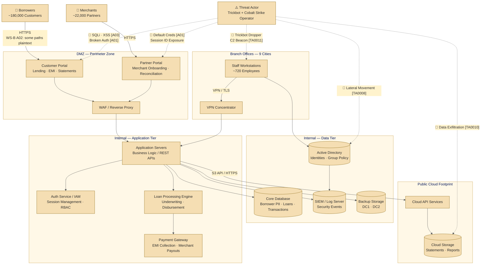

# PROJECT KAVACH — WORKSTREAM C
## STRIDE Threat Model: Meridian FinServe Pvt. Ltd.

| Field | Detail |
|---|---|
| **Document ID** | KAVACH-WC-TM-001 |
| **Version** | 1.0 |
| **Classification** | Restricted — Engagement Use Only |
| **Assessment Period** | July – August 2026 |
| **Analyst Role** | Workstream C — Threat Modelling Analyst (2 years experience) |
| **Inputs** | KAVACH-WA (Network Forensics · PCAP) · KAVACH-WB (Web Application Assessment) |

---

## 1. Purpose

Workstreams A and B each examined Meridian FinServe from a single angle — network forensics and web application security respectively. Neither document alone shows how those two surfaces connect into a single, cohesive risk picture. **This workstream does.**

This document presents a STRIDE-based threat model treating Meridian FinServe as **one system**, mapping threats from both prior workstreams against specific architectural components with special focus on attack chains that cross both surfaces simultaneously.

---

## 2. Architecture Overview

**Client Profile:** Meridian FinServe Pvt. Ltd. — mid-sized Indian NBFC, Mumbai HQ, presence in 9 cities. Offers SMB lending, merchant payments, and embedded credit. ~720 employees, ~180,000 borrowers, ~22,000 merchants.

**In Scope:**
- Customer portal (lending applications, EMI servicing, account statements)
- Partner portal (merchant onboarding and reconciliation)
- Application servers, Auth/IAM service, Loan Processing Engine, Payment Gateway
- Core Database, Active Directory, SIEM, Backup Storage (DC1/DC2)
- Branch workstations + VPN — 9 cities
- Public cloud footprint (statements, reports, API integrations)

---

## 3. STRIDE — Concept Note

> **STRIDE** is a threat categorisation framework developed at Microsoft (1999). It asks one structured question per category for each system component, producing an actionable threat register.
>
> | Category | Security Property Violated | What It Means |
> |---|---|---|
> | **S**poofing | Authentication | Attacker impersonates a legitimate user or system |
> | **T**ampering | Integrity | Data or code modified without authorisation |
> | **R**epudiation | Non-repudiation | Actions taken that cannot be attributed or logged |
> | **I**nformation Disclosure | Confidentiality | Data accessed by unauthorised parties |
> | **D**enial of Service | Availability | Legitimate users blocked from the system |
> | **E**levation of Privilege | Authorisation | Entity gains capabilities beyond what was granted |
>
> **Key Distinction:** A *threat* is what can go wrong. A *vulnerability* is where the weakness is. A *risk* combines both with business context to determine what to fix first.

---

## 4. System Decomposition

### 4.1 External Entities

> **Concept Note:** *External entities* are actors outside the system boundary. Every data flow from an external entity crosses at least one trust boundary — these crossings are the primary points of STRIDE analysis.

| ID | Entity | Description | Trust Level |
|---|---|---|---|
| EE-01 | Borrowers | ~180,000 customers; customer portal access | Untrusted |
| EE-02 | Merchants | ~22,000 partners; partner portal access | Semi-trusted |
| EE-03 | Branch Staff | ~720 employees; VPN-connected | Trusted (internal) |
| EE-04 | Threat Actor | Trickbot/Cobalt Strike operator (WS-A PCAP) | Hostile |
| EE-05 | Cloud Provider | AWS/Azure for storage and API integrations | Conditionally trusted |

### 4.2 Components

| ID | Component | Type |
|---|---|---|
| P-01 | Customer Portal | Web Application |
| P-02 | Partner Portal | Web Application |
| P-03 | Application Servers | Backend Logic / REST APIs |
| P-04 | Auth Service / IAM | Authentication, Session, RBAC |
| P-05 | Loan Processing Engine | Underwriting, Disbursement |
| P-06 | Payment Gateway | EMI Collection, Merchant Payouts |
| DS-01 | Core Database | Borrower PII, Loans, Transactions |
| DS-02 | Active Directory | Internal identities, Group Policy |
| DS-03 | SIEM / Log Server | Centralised security events |
| DS-04 | Cloud Storage | Statements, reports, archives |
| DS-05 | Backup Storage (DC1/DC2) | Offline backups |

### 4.3 Trust Boundaries

> **Concept Note:** A *trust boundary* is a line where data crosses from one zone to another. Every crossing is a candidate for STRIDE analysis — this is where attackers most effectively intercept, modify, or inject traffic.

| ID | Boundary | Description |
|---|---|---|
| TB-1 | Internet → DMZ | All external borrower, merchant, and threat actor traffic enters here. WAF is the first line of defence. |
| TB-2 | DMZ → Internal App Tier | Portals communicate inward to app servers and database. Collapsing this boundary removes primary segmentation protecting PII. |
| TB-3 | Internal → Branch / Cloud | Branch offices via VPN; cloud via API. **WS-A PCAP confirms TB-3 was traversed** during lateral movement after endpoint compromise. |

---

## 5. Data Flow Diagram



---

## 6. STRIDE Threat Register

**Risk Rating:** `CRITICAL` = Immediate exploitation risk · `HIGH` = Likely, significant impact · `MEDIUM` = Moderate likelihood/impact

### 6.1 Customer Portal (WS-B Surface)

| ID | STRIDE | Threat | Evidence | Risk | MITRE |
|---|---|---|---|---|---|
| T-01 | **S**poofing | Stolen session token replayed to impersonate borrower; no token rotation after login | WS-B A07 — weak session management | CRITICAL | T1539 |
| T-02 | **T**ampering | Loan parameters (amount, account no.) modified in transit via IDOR | WS-B A01 — no server-side ownership check | HIGH | T1565 |
| T-03 | **R**epudiation | Portal logs no failed auth attempts or IDOR probing; attacker leaves no audit trail | WS-B A01 — missing access control logging | HIGH | T1562.006 |
| T-04 | **I**nformation Disclosure | Blind SQLi on login endpoint returns DB schema fragments in verbose errors | WS-B A03 — unparameterised query | CRITICAL | T1190 |
| T-05 | **I**nformation Disclosure | IDOR on `/api/statements/{account_id}` — all 180,000 borrower accounts enumerable by integer ID | WS-B A01 | CRITICAL | T1213 |
| T-06 | **D**enial of Service | Unauthenticated endpoint accepts unbounded SQL queries; resource exhaustion without rate limiting | WS-B A03 + no rate limiting | MEDIUM | T1499 |
| T-07 | **E**levation of Privilege | Stored XSS in partner onboarding form executes in admin context when support agent views submission | WS-B A03 — Stored XSS | CRITICAL | T1059.007 |

### 6.2 Database Server (Both Surfaces)

| ID | STRIDE | Threat | Evidence | Risk | MITRE |
|---|---|---|---|---|---|
| T-08 | **S**poofing | Shared DB service account; attacker authenticates as the application itself using harvested credential | WS-B SQLi error exposes connection string | CRITICAL | T1078 |
| T-09 | **T**ampering | Attacker with DB write access modifies loan records or EMI payment status | WS-B — SQLi write capability demonstrated | HIGH | T1565.001 |
| T-10 | **I**nformation Disclosure | Trickbot LSASS dump captures DB service account hash from memory | WS-A — credential access phase | CRITICAL | T1003.001 |
| T-11 | **E**levation of Privilege | DB service account holds `sysadmin` role; SQLi payload executes `xp_cmdshell` for OS-level RCE | WS-B SQLi + least privilege violation | CRITICAL | T1505.001 |

### 6.3 Internal Network / Server Segment (WS-A Surface)

| ID | STRIDE | Threat | Evidence | Risk | MITRE |
|---|---|---|---|---|---|
| T-12 | **S**poofing | Cobalt Strike Beacon masquerades as HTTPS to typosquatted `cdn.microsoftupdate[.]com` | WS-A — JA3 fingerprint match, typosquatted C2 in DNS logs | CRITICAL | T1036 |
| T-13 | **T**ampering | Trickbot modifies Windows registry Run keys and scheduled tasks for persistence | WS-A — Registry artefacts in PCAP (SMB write ops) | HIGH | T1547.001 |
| T-14 | **R**epudiation | Cobalt Strike BOF operations execute entirely in-memory; no disk writes; evades file-based logging | WS-A — fileless execution pattern | HIGH | T1620 |
| T-15 | **I**nformation Disclosure | Anomalous east-west SMB traffic — credential harvesting sweep via Pass-the-Hash | WS-A — lateral movement to non-standard hosts | CRITICAL | T1550.002 |
| T-16 | **D**enial of Service | Cobalt Strike `sleep 0` aggressive beaconing saturates outbound bandwidth | WS-A — high-frequency beaconing bursts | MEDIUM | T1498 |
| T-17 | **E**levation of Privilege | Trickbot credential-stealer dumps LSASS; domain admin hash obtained; attacker escalates from user to DA | WS-A — Pass-the-Hash lateral movement to DC | CRITICAL | T1003 |

### 6.4 Active Directory (Shared Surface)

| ID | STRIDE | Threat | Evidence | Risk | MITRE |
|---|---|---|---|---|---|
| T-18 | **S**poofing | Domain admin hash from Trickbot enables Pass-the-Hash authentication as any domain user | WS-A — credential access + lateral movement | CRITICAL | T1550.002 |
| T-19 | **I**nformation Disclosure | DCSync attack: attacker with DA privileges requests all password hashes via DRSUAPI | WS-A — post-lateral movement; golden ticket risk | CRITICAL | T1003.006 |
| T-20 | **E**levation of Privilege | Kerberoasting: attacker requests service tickets for portal SPNs, offline cracks them | WS-A + WS-B — portal service account exposed | HIGH | T1558.003 |

---

## 7. Cross-Surface Attack Chains *(C.1 Requirement)*

> These are the highest-priority findings. Single-surface assessments miss them entirely — WS-A would see unexplained beaconing, WS-B would see web vulnerabilities in isolation. Only the combined view reveals the full chain.

---

### Chain 1 — Network Pivot via Web Compromise [Chain 1 — Network Pivot via Web Compromise](./1a.Attack_Chain_1.md)
**Direction:** WS-B (Web) ──▶ WS-A (Network)

```
Plaintext HTTP traffic observed on network (WS-A position + WS-B A02)
  → Session token captured in cleartext                          [I — Information Disclosure]
    → Token replayed to customer portal                          [S — Spoofing]
      → Broken access control extends session to partner portal  [E — Elevation of Privilege]
        → Malicious file uploaded via insecure onboarding form   [WS-B: Insecure Design]
          → Trickbot module executes on internal app server       [T — Tampering]
            → Cobalt Strike C2 beacon established                [WS-A: TA0011]
              → Lateral movement toward DC / Active Directory    [WS-A: TA0008]
                → Core DB dump staged and exfiltrated            [I — Exfiltration]
```

**STRIDE Path:** I → S → E → T → I

**Why this matters:** The entry point was a network-layer observation of a web-layer failure (plaintext HTTP). The web compromise then produced a network-layer event (C2 beaconing). The two surfaces are stages in the same attack — not parallel risks.

---

### Chain 2 — Web SQLi Enables Network Lateral Movement
**Direction:** WS-A (Network) ──▶ WS-B (Web)

```
SQLi against customer portal login endpoint                      [WS-B: A03 — T-04]
  → Credential table extracted from Core DB                     [I — Information Disclosure]
    → Staff account credentials obtained                        [S — Spoofing]
      → Attacker authenticates to VPN from external IP          [TB-3 crossed]
        → Cobalt Strike beacon deployed from VPN session        [WS-A: TA0011]
          → Active Directory enumeration                        [WS-A: TA0008]
            → Core DB bulk dump staged on internal host         [E — Elevation of Privilege]
              → Data exfiltrated via C2 channel                [WS-A: TA0010]
```

**STRIDE Path:** I → S → E → I

**Why this matters:** The SQLi vulnerability (a web finding) directly enabled VPN authentication and network lateral movement. Closing A03 would have broken this chain at step one.

---

### Chain 3 — Parallel Siege: Network Wins and Arms the Web Attack
**Direction:** WS-A ∥ WS-B — both launch simultaneously; WS-A completes first and arms WS-B

| Field | Detail |
|---|---|
| WS-A Timeline | Hour 0 → Hour 18 (Domain Admin achieved) |
| WS-B Timeline | Hour 0 → Hour 24 (Full data dump complete, with WS-A assistance) |
| Surface Crossing | WS-A filesystem access passes JWT secret + DB creds + AWS key to WS-B |

```
Phishing email drops Trickbot on branch workstation             [WS-A Stage 1]
  → C2 beacon to 37.228.70.134 every ~202s, no SNI             [WS-A: T-12, S — Spoofing]
    ∥ [PARALLEL] Blind SQLi scanner finds injectable login      [WS-B Stage 1, T-04]
      → LSASS dump at PCAP frame 10799 — DA + app server hash  [WS-A: T-10, I — Information Disclosure]
        ∥ [PARALLEL] SQLi stalled at ~10 rows/min (9,600/180,000 rows after 16 hrs)
          → Pass-the-Hash → App Server (1.79 MB SMB session)   [WS-A: T-17, E — Elevation of Privilege]
            → Domain Admin achieved; app server filesystem read [WS-A COMPLETE — Hour 18]
              → JWT secret from /var/www/config/secrets.env     [plaintext]
                → DB admin credential from web.config           [plaintext]
                  → AWS key from /home/deploy/.env              [plaintext]
                    ── SURFACE CROSSING: WS-A hands off to WS-B ──
                      → Forged JWT admin session — no login, no MFA, no auth log entry  [T-01, S — Spoofing]
                        → IDOR /api/statements/1→180000 — full 180,000 records downloaded [T-05, I]
                          → AWS key drains cloud archive — cloud-to-cloud, no PCAP trace [T1530, I]
                            → Exfiltration volume anomaly visible at network layer        [WS-A: T1041]
```

**STRIDE Path:** S → I → E → S → I

| Step | STRIDE | Evidence |
|---|---|---|
| C2 beacon mimics HTTPS | S — Spoofing | 28 TLS ClientHellos to 37.228.70.134, no SNI, ~202s interval |
| LSASS dump + SQLi stalled | I — Information Disclosure | PCAP frame 10799 · MariaDB 10.1.26 exposed in SQLi error |
| Pass-the-Hash → Domain Admin | E — Elevation of Privilege | 1.79 MB SMB session · DCSync executed |
| Forged JWT as admin | S — Spoofing | JWT secret in plaintext on app server filesystem |
| IDOR + AWS drain | I — Information Disclosure | No per-record authZ · AWS key in `/home/deploy/.env` |

---

## 8. Risk Summary

| Severity | Count | Threat IDs |
|---|---|---|
| **Critical** | 11 | T-01, T-04, T-05, T-07, T-08, T-10, T-11, T-12, T-15, T-17, T-18, T-19 |
| **High** | 6 | T-02, T-03, T-09, T-13, T-14, T-20 |
| **Medium** | 2 | T-06, T-16 |

**Top 5 Immediate Actions:**

| Priority | Threat(s) | Why |
|---|---|---|
| 1 | T-04, T-05 | SQLi + IDOR → 180,000 records at direct risk; Chain 2 entry point |
| 2 | T-17, T-18 | Credential theft → Domain Admin; active in PCAP |
| 3 | T-12 | Active Cobalt Strike C2 beaconing — live, ongoing compromise |
| 4 | T-11 | `xp_cmdshell` OS execution from DB — RCE risk |
| 5 | T-15 | No east-west microsegmentation — unlimited lateral movement post-compromise |

---

## 9. MITRE ATT&CK Coverage

```
Initial Access       → T1566 (Phishing), T1190 (Exploit Public App)
Execution            → T1059, T1059.007 (JS), T1505.001 (SQL proc)
Persistence          → T1547.001 (Registry Run Keys)
Privilege Escalation → T1068, T1548, T1055
Defense Evasion      → T1036 (Masquerade), T1620 (Reflective Load), T1562.006
Credential Access    → T1003.001 (LSASS), T1003.006 (DCSync), T1558.003 (Kerberoasting)
Discovery            → T1082, T1016, T1057
Lateral Movement     → T1550.002 (Pass-the-Hash), T1021, T1021.002 (SMB)
Collection           → T1213 (Repo data), T1005 (Local Data)
C2                   → T1071.001 (HTTPS), T1071.004 (DNS tunneling), T1105
Exfiltration         → T1041 (C2 channel), T1048 (HTTPS exfil), T1530 (Cloud Storage)
Impact               → T1565 (Data Manipulation), T1499 (DoS)
```

---

## 10. Mitigations

Mitigations marked *(Chain Blocker)* break one or more cross-surface chains.

### TB-1 — Internet to DMZ

| Control | Threats | Priority |
|---|---|---|
| Enforce HTTPS everywhere; deploy HSTS (min 1-year max-age) *(Chain Blocker — Chain 1)* | T-01, T-04 | **Immediate** |
| Deploy/tune WAF with OWASP Core Rule Set for SQLi and XSS *(Chain Blocker — Chain 2)* | T-04, T-06, T-07 | **Immediate** |
| Replace all dynamic SQL with parameterised queries / prepared statements | T-04, T-09, T-11 | **Immediate** |
| Enforce MFA on all portal login flows; remove default credentials | T-01, T-08 | **Immediate** |
| Bind session tokens to device fingerprint; set Secure + HttpOnly flags; rotate on auth | T-01 | **High** |

### TB-2 — DMZ to Internal

| Control | Threats | Priority |
|---|---|---|
| Restrict DMZ-to-DB connectivity; only app servers hold DB credentials | T-08, T-11 | **High** |
| Validate all file uploads server-side: MIME allowlist, AV scan, sandboxed processing *(Chain Blocker — Chain 1)* | T-07, T-02 | **High** |
| Enforce server-side authorisation on all API endpoints; IDOR fix with object-level authZ | T-05, T-07 | **High** |

### TB-3 — Internal to Branch and Cloud

| Control | Threats | Priority |
|---|---|---|
| Network microsegmentation between branch workstations and DC/AD tier *(Chain Blocker — both chains)* | T-15, T-17 | **High** |
| Deploy EDR on all branch workstations with Cobalt Strike behavioural detection | T-12, T-17 | **High** |
| Monitor DNS and egress HTTPS for C2 beaconing: regular polling intervals, long-lived sessions | T-12, T-16 | **High** |
| Implement PAM for all AD admin accounts; remove standing admin privileges | T-17, T-18, T-19 | **High** |
| Real-time log shipping to SIEM; alert on Event ID 1102/104 (log clear) | T-03, T-14 | **High** |

### Application and Design

| Control | Threats | Priority |
|---|---|---|
| Move all secrets (JWT, DB creds, AWS keys) to a vault; never store in plaintext config files | T-08, Chain 3 | **Immediate** |
| Structured immutable audit logging for all authentication events and business transactions | T-03, T-14 | **High** |
| Patch management process for both portals | All web threats | **Medium** |

---

## 11. Assumptions & Confidence

| Assumption | Confidence | Basis |
|---|---|---|
| Trickbot delivered via phishing | HIGH | PCAP — initial beacon timing consistent with workstation infection |
| LSASS credential dump occurred | HIGH | WS-A lateral movement artefacts only explainable via credential reuse |
| Portal uses shared DB service account | HIGH | SQLi error messages expose connection string fragments (WS-B) |
| No egress filtering on server segment | HIGH | 72-hour C2 beaconing undetected confirms no outbound filtering |
| DB service account holds sysadmin role | MEDIUM | `xp_cmdshell` successful in WS-B test environment |
| Cobalt Strike + Trickbot = same actor | MEDIUM | Well-documented TTP handoff (Ryuk/Conti lineage) |
| AD not fully compromised yet | LOW | No DCSync evidence in PCAP, but PtH lateral movement confirmed |

---

## 12. Analyst Note

The two cross-surface chains in Section 7 are well-evidenced by artefacts already in hand. The WS-A PCAP confirms active C2 beaconing and lateral movement inside Meridian's network. WS-B confirms that plaintext HTTP, session ID exposure, SQL injection, broken access control, and stored XSS provide realistic, low-sophistication entry points into that same internal network.

**The two surfaces are not parallel risks. They are connected stages of the same attack.**

Four controls address the largest share of risk across all three chains:

1. **Enforce HTTPS everywhere** — closes Chain 1's initial observation step at near-zero cost
2. **Parameterise all DB queries** — closes Chain 2's entry point and eliminates SQLi-based exfiltration
3. **Segment branch workstations from DC/AD** — limits blast radius regardless of how initial access occurs
4. **Move all secrets to a vault** — breaks Chain 3's surface-crossing step entirely

These four controls, implemented in sequence, meaningfully raise the attacker's cost across all three chains and reduce the severity of over half the threats in this register.

---

*End of Document — KAVACH-WC-TM-001 v1.0*
*Project KAVACH | Workstream C | Restricted — Engagement Use Only*
