# PROJECT KAVACH — WORKSTREAM C
## C.2 Implementation Timeline: Defence-in-Depth Rollout

<small>**Document:** KAVACH-WC-DiD-001-TL · **Workstream:** C · **Type:** Implementation Roadmap · **Sprint:** 4 weeks · **Controls:** 29 total · **Layers:** 7 · **References:** KAVACH-WC-DiD-001 v1.1</small>

---

## Why This Timeline Exists

A Defence-in-Depth proposal without a sequenced rollout plan is a wish list, not a strategy. This timeline answers a question the document alone cannot: **in what order, and in which week, does each of the 29 controls actually get done?**

The sequencing follows three rules derived directly from the engagement findings:

**Rule 1 — Break the active chains first.** Three attack chains were confirmed during the engagement. Controls that sever those chains are executed in Week 1, regardless of effort level. The C2 beacon was still active at time of engagement; every day of delay is a day of continued exposure.

**Rule 2 — Effort determines the sprint, not the layer.** `S`-rated controls (days of work) land in Week 1. `M`-rated controls (weeks) are scoped into Weeks 2–3 sprints. `L`-rated controls (months) are kicked off in Week 4 with design and procurement — they cannot be rushed without causing service disruptions. Collapsing all 29 into a single sprint guarantees broken services and rollback debt.

**Rule 3 — WS-B patches carry forward.** The parameterised query fix, IDOR remediation, output encoding patch, and TLS enforcement were already applied in the DVWA/Juice Shop test environment during Workstream B. Those fixes propagate to the production-analogue stack in this sprint — they are not started from scratch.

---

## Swimlane Timeline — 4-Week Rollout

> Each row is a DID layer. Each column is a sprint week. Status legend below the chart.

```mermaid
gantt
    title Defence-in-Depth rollout — Meridian FinServe · Project KaVacH
    dateFormat  X
    axisFormat  Week %d

    section Identity
    ID-01 MFA enforcement (S)             :done,   id01, 1, 2
    ID-02 Remove default credentials (S)  :done,   id02, 1, 2
    ID-03 Session token hardening (S)     :done,   id03, 1, 2
    ID-04 Secrets vault - begin (M)       :active, id04, 8, 14
    ID-04 Secrets vault - complete (M)    :active, id04b, 14, 21
    ID-05 PAM / JIT admin - kickoff (L)   :crit,   id05, 21, 28

    section Perimeter
    PR-02 DNS firewall - block C2 (S)     :done,   pr02, 1, 2
    PR-01 WAF deploy - detection mode (M) :        pr01, 8, 14
    PR-01 WAF - switch to blocking (M)    :        pr01b, 14, 21
    PR-03 Egress allowlist - map (M)      :        pr03, 14, 21
    PR-04 JA3 fingerprint monitor (M)     :        pr04, 14, 21
    PR-03 Egress allowlist - enforce (M)  :        pr03b, 21, 28

    section Segmentation
    SEG-03 Jump-host deploy (M)           :        seg03, 8, 14
    SEG-02 Branch VPN isolation (M)       :        seg02, 14, 21
    SEG-03 Policy enforcement live (M)    :        seg03b, 14, 21
    SEG-01 East-west microseg - kickoff (L) :crit, seg01, 21, 28

    section Application
    APP-03 Output encoding + CSP (S)      :done,   app03, 1, 2
    APP-04 Server-side validation (S)     :done,   app04, 1, 2
    APP-05 Suppress verbose errors (S)    :done,   app05, 1, 2
    APP-01 Parameterise DB queries (M)    :active, app01, 8, 14
    APP-02 Object-level authZ / IDOR (M)  :active, app02, 8, 14
    APP-01 Full regression tested (M)     :done,   app01b, 14, 21
    APP-02 AuthZ all endpoints (M)        :done,   app02b, 14, 21

    section Data
    DAT-01 TLS 1.2+ and HSTS (S)         :done,   dat01, 1, 2
    DAT-04 Rotate leaked AWS key (S)      :done,   dat04, 1, 2
    DAT-03 Tokenise loan IDs - begin (M)  :        dat03, 8, 14
    DAT-03 Tokenisation - API refactor (M):        dat03b, 14, 21
    DAT-02 Field-level PII encryption (L) :crit,   dat02, 21, 28

    section Observability
    OBS-01 SIEM log shipping - start (M)  :        obs01, 8, 14
    RSP-01 IR runbook draft (S-M)         :        rsp01a, 8, 14
    OBS-02 NDR deploy - baseline (M)      :        obs02, 14, 21
    OBS-03 Immutable audit logging (M)    :        obs03, 14, 21
    OBS-04 EDR rollout 720 endpoints (M)  :        obs04, 21, 28

    section Response
    RSP-02 Isolation playbook (S)         :done,   rsp02, 1, 2
    RSP-01 IR runbook - tabletop (S-M)    :active, rsp01b, 8, 14
    RSP-03 Memory forensics tooling (M)   :        rsp03, 14, 21
    RSP-04 Post-incident cadence (S-L)    :        rsp04, 21, 28
```

*Figure TL-01 — 29 controls sequenced across 4 weeks by effort rating and chain-breaking priority. `done` = patched/complete · `active` = in progress · `crit` = L-effort kickoff.*

---

## Swimlane Summary Table

| Layer | Week 1 — Fire now `S` | Week 2 — Sprint start `M` | Week 3 — Sprint cont. `M` | Week 4 — L-effort kickoff |
|---|---|---|---|---|
| **Identity** | ✅ ID-01 MFA · ✅ ID-02 Default creds · ✅ ID-03 Sessions | 🔄 ID-04 Secrets vault begins | 🔄 ID-04 continues | 🚀 ID-05 PAM / JIT |
| **Perimeter** | ✅ PR-02 DNS firewall | 📋 PR-01 WAF detection mode | 📋 PR-01 → blocking · 📋 PR-03 Egress · 📋 PR-04 JA3 | 🔄 PR-03 enforcement live |
| **Segmentation** | — | 📋 SEG-03 Jump-host deploy | 📋 SEG-02 Branch isolation · 🔄 SEG-03 policy live | 🚀 SEG-01 East-west micro |
| **Application** | ✅ APP-03 CSP/encoding · ✅ APP-04 Validation · ✅ APP-05 Errors | 🔄 APP-01 SQLi patch · 🔄 APP-02 IDOR fix | ✅ APP-01 complete · ✅ APP-02 complete | — |
| **Data** | ✅ DAT-01 TLS + HSTS · ✅ DAT-04 Rotate AWS key | 📋 DAT-03 Tokenise IDs | 🔄 DAT-03 API refactor | 🚀 DAT-02 PII encryption |
| **Observability** | — | 📋 OBS-01 SIEM agents · 📋 RSP-01 Runbook draft | 📋 OBS-02 NDR · 📋 OBS-03 Audit logs | 📋 OBS-04 EDR 720 endpoints |
| **Response** | ✅ RSP-02 Isolation playbook | 🔄 RSP-01 Tabletop exercise | 📋 RSP-03 Memory forensics | 📋 RSP-04 30/60/90 cadence |

**Legend:** ✅ Patched / done &nbsp;·&nbsp; 🔄 In progress &nbsp;·&nbsp; 📋 Planned this sprint &nbsp;·&nbsp; 🚀 L-effort kickoff

---

## Critical Points — Read Before Executing

> These are not optional notes. Each point below reflects a failure mode observed either in the engagement itself or in real-world implementations of similar controls. Ignoring them converts this roadmap from a security plan into a service disruption.

---

### 1. Week 1 is non-negotiable — the C2 beacon was still live

The WS-A PCAP confirms Cobalt Strike C2 beaconing to `37.228.70.134` at ~202-second intervals. At time of engagement, the connection was still active. PR-02 (DNS firewall block) and DAT-04 (AWS key rotation) must be executed **before any other week's work begins**. Every day this is deferred, the attacker retains the C2 channel.

---

### 2. APP-01 and APP-02 are M-effort, not S — do not rush them

The WS-B patches for SQLi parameterisation and IDOR authorisation were applied in the DVWA/Juice Shop test environment. Propagating these to the full application stack requires a code audit, regression testing on all data-access paths, and a deployment window. Treating them as S-effort and deploying without regression testing will break queries and create new bugs. Scope into Week 2 sprint properly.

---

### 3. WAF must run in detection mode for two weeks before blocking

PR-01 goes live in Week 2 in detection-only mode. Do not switch to blocking until the team has reviewed two weeks of alert output and tuned false-positive rules. Enabling blocking mode on an untuned WAF will reject legitimate loan application requests and payment flows — a direct business impact visible to 180,000 borrowers.

---

### 4. ID-04 (secrets vault) is the linchpin of Chain 3 — it is M, not S

The Immediate Actions table lists ID-04 at priority 1. It is **M-effort** — the JWT secret, DB credentials, and AWS key live in three different config files across the application. Moving them to vault requires refactoring the application startup path, not just copying a file. Schedule a dedicated sprint story. Until it is done, Chain 3 remains fully exploitable at the filesystem access step.

---

### 5. SEG-01 (east-west microsegmentation) cannot start before full flow mapping

East-west microsegmentation (SEG-01) is L-effort and kicked off in Week 4. The reason it cannot start earlier is not resource availability — it is that enabling default-deny east-west rules before mapping all legitimate server-to-server flows will cause cascading service failures. The flow mapping exercise must precede rule enforcement by at least 4–6 weeks. Week 4 starts that mapping exercise, not the enforcement.

---

### 6. OBS-02 NDR needs a 4-week baseline before it can alert meaningfully

The NDR deployment (OBS-02) in Week 3 begins a 4-week passive baseline collection period. Alerting should not be enabled until that baseline is complete. The WS-A PCAP shows that the C2 beacon ran undetected because there was no established normal to detect against. Rushing NDR into alert mode without a baseline produces the same outcome — alert fatigue from legitimate traffic patterns that look anomalous without context.

---

### 7. RSP-03 (memory forensics) must happen before any reboot of a compromised host

The WS-A capture includes in-memory Cobalt Strike BOF (beacon object file) activity that left no disk artefacts. If an incident occurs before RSP-03 tooling is in place and a responder reboots the affected host, all forensic evidence is destroyed. RSP-03 is a Week 3 item — this means the team is operating in a forensic blind spot for weeks 1 and 2. The Week 1 isolation playbook (RSP-02) explicitly covers quarantine-without-reboot as a stopgap.

---

### 8. ID-05, SEG-01, DAT-02 require budget approval — start that conversation in Week 1

The three L-effort controls — PAM tooling (ID-05), east-west microsegmentation (SEG-01), and field-level PII encryption (DAT-02) — each require procurement and budget sign-off. Week 4 is their kickoff, but procurement cycles for enterprise tooling run 6–12 weeks. The business case must be presented to engineering leadership and finance **during Week 1**, not Week 4. If this conversation starts in Week 4, the kickoff slips to Month 2 and the L-effort controls land in Month 3 at earliest.

---

*End of Document — KAVACH-WC-DiD-001-TL*
*Project KAVACH | Workstream C | Implementation Timeline | Restricted — Engagement Use Only*
