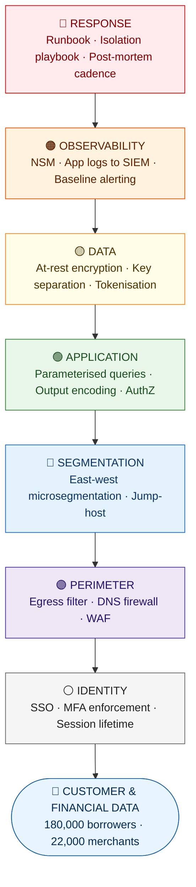
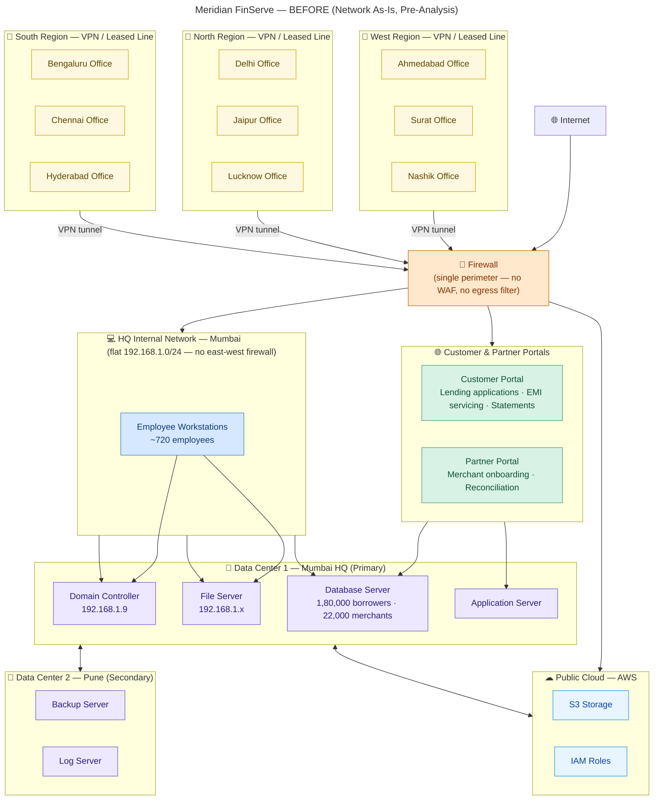
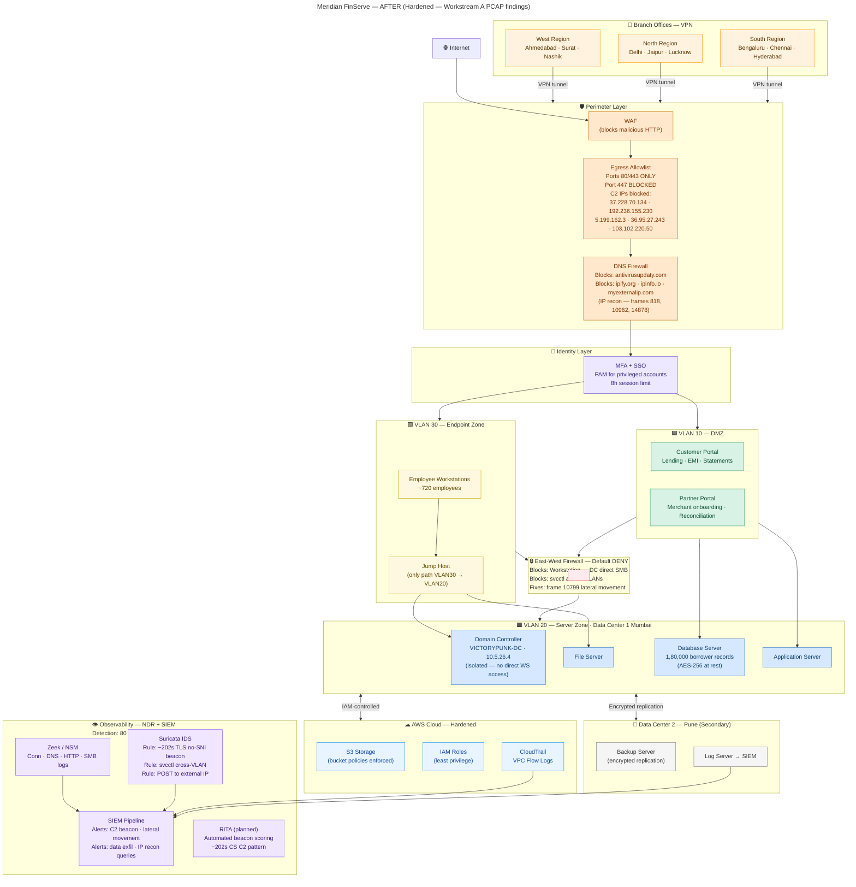

# PROJECT KAVACH — WORKSTREAM C
## C.2 Defense-in-Depth Proposal: Meridian FinServe Pvt. Ltd.

| Field | Detail |
|---|---|
| **Document ID** | KAVACH-WC-DiD-001 |
| **Version** | 1.1 |
| **Classification** | Restricted — Engagement Use Only |
| **References** | KAVACH-WA (Network PCAP) · KAVACH-WB (Web Assessment) · KAVACH-WC-TM-001 (STRIDE Model) |
| **Structure** | One document · Seven layers · Each control cites a WS-A or WS-B finding |

---

## Structure: One Document, Seven Layers

> **This is a single document.** Each layer is a section within it. You do not need a separate file per layer.
> The layers are ordered outermost → innermost. Every layer cites the specific finding that motivates it,
> carries an effort rating **(S = days · M = weeks · L = months)**, and a one-line trade-off.

*Each layer cites a specific WS-A or WS-B finding — the finding that proves the layer was needed.*

---

## Concept Note — What Defence in Depth Actually Means

> **Defence in depth is not depth in defence.**
> Seven layers each at 80% strength is more secure than one layer at 99%.
> The logic: an attacker who defeats one control still faces six independent obstacles.
> Each layer must add something the layer above *cannot* — not just repeat it.
>
> **The board does not buy controls. It buys outcomes.**
> Cost every proposal in terms of what it slows down or breaks — that is the trade-off column.

---

## §0 — Current State: What We Are Defending Against

> The diagram below is the **as-is architecture of Meridian FinServe** at the time of the engagement —
> drawn directly from WS-A PCAP analysis (A.5 Architecture Proposal).
> Every gap visible here — flat network, single perimeter, no WAF, no egress filter — maps to a control in one of the seven layers below.

**Key gaps this diagram confirms (mapped to controls below):**

| Gap Visible in Diagram | Layer Addressing It | Control |
|---|---|---|
| Single perimeter firewall — no WAF, no egress filter | Perimeter | PR-01, PR-02, PR-03 |
| Flat 192.168.1.0/24 — no east-west firewall | Segmentation | SEG-01, SEG-02, SEG-03 |
| No VLAN isolation between portals and internal | Segmentation | SEG-01 |
| No MFA — Portals directly behind single FW | Identity | ID-01, ID-02 |
| No SIEM / log aggregation visible | Observability | OBS-01, OBS-02 |
| Plaintext DB reachable from portals | Application + Data | APP-01, DAT-02 |

---

## Layer 1 — Identity

**What this layer does:** Controls *who* is allowed to act inside the system. Every authentication event, session, and privilege grant is governed here.

**Motivation from findings:**

| Finding | Workstream | Threat ID |
|---|---|---|
| Weak default credentials on partner portal | WS-B A01 | T-01, T-08 |
| Session ID exposed in URL; no rotation after login | WS-B A07 | T-01 |
| Domain admin hash obtained via Trickbot LSASS dump | WS-A TA0006 | T-17, T-18 |
| Portal service accounts Kerberoastable | WS-A + WS-B | T-20 |

### Controls

#### ID-01 · Enforce MFA on All Portal and Admin Login Flows
- **What it does:** Requires a second factor (TOTP or push) for all borrower, merchant, and staff logins. Privileged admin accounts use hardware keys (FIDO2).
- **Effort:** S — configuration change in IdP; FIDO2 tokens = procurement lead time
- **Trade-off:** Adds ~10 seconds to login. Support burden increases for users who lose devices. Branch staff in low-connectivity cities may face TOTP sync issues.

#### ID-02 · Remove All Default Credentials; Enforce Strong Password Policy
- **What it does:** Audit all service accounts and portal accounts for vendor defaults. Enforce minimum 14-character passwords with complexity rules. Rotate all service account credentials immediately.
- **Effort:** S — policy + one-time rotation sprint
- **Trade-off:** Breaks any undocumented integrations that hardcode default credentials. Teams must update config files before rotating.

#### ID-03 · Session Token Hardening
- **What it does:** Set `Secure`, `HttpOnly`, `SameSite=Strict` flags on all cookies. Rotate session IDs on authentication. Bind tokens to IP + User-Agent fingerprint. Set max session lifetime to 15 minutes for privileged actions.
- **Effort:** S — code change in session middleware
- **Trade-off:** Short session lifetimes increase re-authentication friction for users on long tasks (e.g., filling loan applications). Fingerprint binding breaks shared-IP environments (NAT).

#### ID-04 · Secrets Vault — Remove Plaintext Credentials from Filesystem
- **What it does:** Move all plaintext secrets (JWT secret in `/var/www/config/secrets.env`, DB credentials in `web.config`, AWS key in `/home/deploy/.env`) into a secrets manager (HashiCorp Vault or AWS Secrets Manager). Applications fetch at runtime; no secrets on disk.
- **Motivation:** Chain 3 in KAVACH-WC-TM-001 — WS-A filesystem access read all three secrets and handed them to the web attacker, completing the full kill chain.
- **Effort:** M — application refactor required at all three injection points
- **Trade-off:** Introduces vault as a new dependency; if vault is unavailable, applications cannot start. Requires runbook for vault recovery.

#### ID-05 · Privileged Access Management (PAM) for Active Directory Admin Accounts
- **What it does:** Eliminate standing domain admin sessions. All DA access is just-in-time (JIT), time-limited, and requires approval workflow. Separate admin workstations for AD operations.
- **Effort:** L — PAM tooling procurement + AD restructure
- **Trade-off:** Slows incident response if PAM system itself is unavailable. Requires culture change for IT admins accustomed to persistent DA sessions.

---

## Layer 2 — Perimeter

**What this layer does:** Controls *what enters and exits* the network at the internet boundary. This is the first physical enforcement point before traffic reaches any application.

**Motivation from findings:**

| Finding | Workstream | Threat ID |
|---|---|---|
| Cobalt Strike C2 beaconing undetected for 72+ hours | WS-A TA0011 | T-12, T-16 |
| No egress filtering — beacon traffic exited freely | WS-A | T-12 |
| Typosquatted C2 domain resolved without DNS block | WS-A | T-12 |
| SQLi + XSS payloads reached application without WAF interception | WS-B A03 | T-04, T-07 |

### Controls

#### PR-01 · Deploy and Tune WAF with OWASP Core Rule Set
- **What it does:** Place a Web Application Firewall in front of both portals. Enable CRS rules for SQLi, XSS, path traversal, and SSRF. Set to blocking mode after a two-week detection-only baseline period.
- **Effort:** S — if WAF infrastructure exists; M — if net-new deployment
- **Trade-off:** CRS in blocking mode generates false positives. Legitimate requests using SQL-like syntax (e.g., search fields) may be blocked. Requires tuning sprints.

#### PR-02 · DNS Firewall — Block Known-Malicious and Typosquatted Domains
- **What it does:** Deploy a DNS RPZ (Response Policy Zone) or cloud DNS firewall. Blocklist known C2 domains, typosquatted update domains, and all domains not required for business operation. The specific domain `cdn.microsoftupdate[.]com` (typosquat observed in WS-A) should be blocked immediately.
- **Effort:** S — DNS configuration change
- **Trade-off:** Overzealous blocklists break legitimate services. Requires exception process for newly needed domains. Attackers can rotate C2 domains faster than blocklists update.

#### PR-03 · Egress Filtering — Allowlist Outbound Destinations
- **What it does:** Implement explicit outbound allowlist on the server segment firewall. Only approved destinations (payment processors, cloud APIs, update servers) may receive outbound traffic. All other outbound connections are blocked and logged.
- **Effort:** M — requires mapping all legitimate outbound flows before enforcement
- **Trade-off:** Breaks undocumented outbound integrations. Any new third-party integration requires firewall change request. High operational overhead in early months.

#### PR-04 · JA3/JA3S Fingerprint Monitoring for TLS Anomalies
- **What it does:** Deploy JA3 fingerprint inspection on egress TLS. Alert on fingerprints matching known Cobalt Strike or commodity RAT profiles. The WS-A PCAP already contains a confirmed JA3 match for Cobalt Strike (`6734f37431670b3ab4292b8f60f29984`).
- **Effort:** M — requires NDR or inline TLS inspection capability
- **Trade-off:** JA3 fingerprints can be spoofed by sophisticated actors. Generates noise from legitimate tools (pentest clients, some enterprise software) with matching fingerprints.

---

## Layer 3 — Segmentation

**What this layer does:** Controls *lateral movement* once an attacker is inside the perimeter. Limits blast radius so a single compromised endpoint cannot reach everything.

**Motivation from findings:**

| Finding | Workstream | Threat ID |
|---|---|---|
| East-west SMB traffic from compromised workstation to server segment | WS-A TA0008 | T-15 |
| Pass-the-Hash from branch workstation to Domain Controller | WS-A TA0008 | T-17, T-18 |
| No observed microsegmentation — lateral movement traversed TB-3 unimpeded | WS-A | T-15 |

### Controls

#### SEG-01 · East-West Microsegmentation on Server Segment
- **What it does:** Implement network policies (firewall rules or SDN policy) that restrict server-to-server traffic to only required flows. App servers may reach DB on port 3306. No workstation-to-DC direct SMB. No server-to-server SMB except designated file shares.
- **Effort:** L — requires full traffic flow mapping before enforcement; significant firewall rule work
- **Trade-off:** Microsegmentation rules break undocumented server-to-server dependencies. Initial rollout will cause service disruptions. Requires sustained engineering effort to maintain as the environment changes.

#### SEG-02 · Branch Workstation Isolation from Datacenter / AD Tier
- **What it does:** Branch workstations connect to VPN but can only reach explicitly allowed application endpoints (portal APIs, approved internal tools). Direct access to AD, DB, or server segment is blocked at VPN policy level.
- **Motivation:** WS-A confirms the entire kill chain began at a Pune branch workstation and traversed directly to the Domain Controller.
- **Effort:** M — VPN split-tunnel policy update
- **Trade-off:** Breaks any branch staff workflow that currently uses direct AD tools (ADUC, GPO editor) from their workstation. Admin tasks must move to dedicated jump-host.

#### SEG-03 · Jump-Host for All Administrative Access
- **What it does:** All administrative sessions to servers, AD, and DB must go through a hardened jump-host (bastion). The jump-host is the only network node with admin-level access to the server segment. Session recording enabled on all jump-host connections.
- **Effort:** M — jump-host deployment + policy enforcement
- **Trade-off:** Adds a hop to every admin workflow. If jump-host is unavailable, all admin access is blocked. Must be a high-availability pair.

---

## Layer 4 — Application

**What this layer does:** Controls *what the application itself can be made to do*. No matter what reaches the app tier, these controls ensure the code behaves safely.

**Motivation from findings:**

| Finding | Workstream | Threat ID |
|---|---|---|
| Blind SQLi on login endpoint — unparameterised query | WS-B A03 | T-04, T-11 |
| IDOR on `/api/statements/{account_id}` — no ownership check | WS-B A01 | T-05 |
| Stored XSS in partner onboarding form | WS-B A03 | T-07 |
| Client-side trust — server trusts parameters set by client | WS-B Insecure Design | T-02 |
| Auth bypass — no token validation on some endpoints | WS-B A07 | T-01 |

### Controls

#### APP-01 · Parameterise All Database Queries
- **What it does:** Replace every dynamic SQL string with parameterised queries or ORM-level prepared statements across both portals and all backend APIs. No string concatenation of user input into SQL. Includes stored procedures.
- **Effort:** M — code audit + refactor across both portal codebases
- **Trade-off:** Refactor risk — incorrect parameterisation can break queries. Requires regression testing of all data-access paths. Legacy stored procedures may need redesign.

#### APP-02 · Object-Level Authorisation on Every API Endpoint
- **What it does:** Every API call that returns or modifies a record must verify that the authenticated session *owns* or *has explicit permission* to access that specific record. The IDOR on `/api/statements/{account_id}` is fixed by checking that the session's `user_id` matches the statement's `account_id` server-side before returning data.
- **Effort:** M — authorisation check added to every data-access endpoint
- **Trade-off:** Performance overhead per request (one extra DB lookup per call). May surface previously hidden multi-tenancy bugs that require data model fixes.

#### APP-03 · Output Encoding and Content Security Policy
- **What it does:** Encode all user-supplied content before rendering in HTML context (HTML entity encoding). Deploy a strict Content Security Policy header that blocks inline scripts and restricts allowed script sources. This kills the stored XSS vector observed in WS-B.
- **Effort:** S — CSP header + encoding library adoption
- **Trade-off:** Strict CSP breaks inline scripts, inline styles, and `eval()` calls. Front-end teams must refactor to external script files. Third-party widgets often violate CSP and will break.

#### APP-04 · Server-Side Validation of All Business Logic Parameters
- **What it does:** Treat all client-provided parameters (loan amount, account number, payment reference) as untrusted. Validate, bound-check, and re-derive all business-critical values server-side before processing. Never trust the client.
- **Effort:** S — design principle enforced in code review
- **Trade-off:** May slow delivery velocity if dev teams are not trained on secure-by-default patterns. Requires code review gates to be enforced.

#### APP-05 · Suppress Verbose Error Messages in Production
- **What it does:** Replace all stack traces, SQL error strings, and connection string fragments returned to users with a generic error code. Log full detail server-side only. The WS-B SQLi yielded MariaDB version, table names, and connection string fragments from error output alone.
- **Effort:** S — environment configuration change
- **Trade-off:** Makes debugging harder for developers without access to server logs. Requires a proper log aggregation path so errors are still visible internally.

---

## Layer 5 — Data

**What this layer does:** Protects the data itself, at rest and in transit, even if every outer layer fails. An attacker who reaches the database should still face encrypted, tokenised, or otherwise unusable data.

**Motivation from findings:**

| Finding | Workstream | Threat ID |
|---|---|---|
| Credentials transmitted in plaintext over HTTP | WS-B A02 | T-04 |
| 180,000 borrower PII records accessible via IDOR — no encryption at field level | WS-B A01 | T-05 |
| Core DB bulk dump staged in Chain 2 and Chain 3 | WS-A + WS-B | T-09, T-10 |
| Cloud archive drained via leaked AWS key | Chain 3 | T1530 |

### Controls

#### DAT-01 · Enforce TLS 1.2+ Across All Data Flows; Deploy HSTS
- **What it does:** Force HTTPS on all portal paths including redirects. Deploy HTTP Strict Transport Security (HSTS) with a minimum one-year `max-age`. Remove all plaintext HTTP endpoints. This closes the session-capture vector from Chain 1.
- **Effort:** S — certificate and server configuration change
- **Trade-off:** Breaks any branch integration or legacy client that does not support TLS 1.2. HSTS preloading is difficult to reverse if cert renewal fails.

#### DAT-02 · Encrypt PII Fields at Rest (Field-Level Encryption)
- **What it does:** Encrypt high-sensitivity fields (Aadhaar, PAN, mobile number, account number) at the application layer before writing to the DB. Encryption keys stored in vault (see ID-04), not on the DB server. A DB dump without the key yields ciphertext only.
- **Effort:** L — schema change + data migration + key management infrastructure
- **Trade-off:** Significant performance overhead on high-cardinality search queries against encrypted fields. Some analytics pipelines that query PII directly will break and require redesign.

#### DAT-03 · Tokenise Payment and Loan Reference Numbers
- **What it does:** Replace real account numbers and loan IDs in API responses with opaque tokens. The mapping table lives behind an access-controlled service. IDOR on a token ID returns nothing useful — there is no sequential integer to enumerate.
- **Effort:** M — tokenisation service + API response refactor
- **Trade-off:** Breaks any client integration that relies on sequential or predictable ID formats (e.g., reconciliation scripts that sort by account ID).

#### DAT-04 · Restrict Cloud Storage Permissions; Rotate Leaked AWS Key Immediately
- **What it does:** Apply least-privilege IAM policies to the AWS key used for cloud storage. The key should only allow read/write to its specific S3 bucket — not `s3:*`. Rotate the key observed in Chain 3 immediately. Enable S3 bucket versioning and object lock.
- **Effort:** S — IAM policy update + key rotation
- **Trade-off:** Over-restrictive IAM may break lambda functions or other services that use the same key with broader permissions. Requires audit of all key usages before restriction.

---

## Layer 6 — Observability

**What this layer does:** Ensures that when something goes wrong, the team *knows about it* — and that the attacker cannot erase the evidence. Observability is what turns a 72-hour dwell time into a 72-minute detection.

**Motivation from findings:**

| Finding | Workstream | Threat ID |
|---|---|---|
| Cobalt Strike beaconing ran undetected for 72+ hours | WS-A | T-12, T-16 |
| In-memory Cobalt Strike BOF — no file-based log evidence | WS-A | T-14 |
| IDOR probing left no audit trail — no per-endpoint access logging | WS-B A01 | T-03 |
| Failed auth attempts not logged at portal level | WS-B A07 | T-03 |

### Controls

#### OBS-01 · Real-Time Log Shipping from All Endpoints and Servers to SIEM
- **What it does:** Ship Windows Event Logs (Sysmon + standard), Linux auditd, and application access logs to the central SIEM in real time. Alert on Event ID 1102/104 (Windows Security log cleared). No log should exist only on the host it was generated on.
- **Effort:** M — agent deployment across 720 branch workstations + server fleet
- **Trade-off:** Significant log volume increases SIEM storage costs. Noisy environments produce alert fatigue if thresholds are not tuned. Requires ongoing rule maintenance.

#### OBS-02 · Network Detection and Response (NDR) with C2 Behavioural Baselines
- **What it does:** Deploy NDR on the server segment egress point. Baseline normal outbound traffic patterns. Alert on: periodic beaconing intervals (fixed ±5s window), connections to domains registered <30 days ago, TLS sessions with no SNI, DNS queries for domains not in the approved allowlist.
- **Motivation:** All four of these patterns were present in the WS-A PCAP and undetected for 72 hours.
- **Effort:** M — NDR tool deployment + 4-week baseline period before alerting
- **Trade-off:** NDR in alert mode only — it does not block. Blocking mode risks disrupting legitimate traffic. Requires a SOC analyst to triage alerts.

#### OBS-03 · Structured Immutable Audit Logging for All Authentication and Business Events
- **What it does:** Every login attempt (success and failure), every session token issuance, every loan decision, every payment initiation, and every admin action must produce a structured (JSON) log entry written to a write-once log store. Logs must be tamper-evident (hash-chained or WORM storage).
- **Effort:** M — application instrumentation + WORM storage setup
- **Trade-off:** Immutable logs cannot be corrected if erroneous entries are written. Log schema changes require versioning. Storage costs for high-volume transaction logs.

#### OBS-04 · EDR on All Workstations with Cobalt Strike Behavioural Detection
- **What it does:** Deploy endpoint detection and response on all 720 branch workstations. Enable LSASS access protection (Credential Guard or equivalent). Alert on: process injection, reflective DLL loading, LSASS read access by non-system processes, abnormal parent-child process relationships.
- **Effort:** M — EDR procurement + rollout across 9 cities
- **Trade-off:** EDR agents consume CPU/memory — older branch workstations may experience performance degradation. Some legitimate admin tools (sysinternals) may trigger alerts.

---

## Layer 7 — Response

**What this layer does:** Defines what happens *after* detection. Speed and precision of response determines whether an incident becomes a headline.

**Motivation from findings:**

| Finding | Workstream |
|---|---|
| No evidence of isolation or containment during 72-hour dwell time | WS-A |
| Active C2 beacon still running at time of engagement | WS-A |
| No post-incident forensic trail preserved (in-memory BOF, log gaps) | WS-A, WS-B |

### Controls

#### RSP-01 · Incident Response Runbook — Malware and C2 Scenarios
- **What it does:** A documented, rehearsed runbook covering the exact scenario observed in WS-A: endpoint receives dropper → C2 beacon established → lateral movement detected. Steps: isolate the affected workstation at VPN policy level, preserve memory image before reboot, notify CISO, escalate to IR retainer.
- **Effort:** S — document creation; M — tabletop exercise and rehearsal
- **Trade-off:** A runbook only works if staff know it exists and have practised it. An untested runbook is a false comfort.

#### RSP-02 · Network Isolation Playbook — Quarantine Without Reboot
- **What it does:** Define a one-command procedure (firewall rule or NAC policy push) that quarantines a specific host at the network level without rebooting it (reboot destroys in-memory evidence). Branch IT staff must be able to execute this with a single ticket to the SOC.
- **Effort:** S — NAC/firewall rule template + staff training
- **Trade-off:** Network isolation breaks all services on the isolated host. If the wrong host is isolated (false positive), it causes an outage. Requires clear escalation authority.

#### RSP-03 · Memory Forensics Capability — Preserve In-Memory Evidence
- **What it does:** Ensure at least one team member (internal or retainer) can acquire a full memory image from a live Windows host before any shutdown or reimage. Fileless Cobalt Strike BOF operations leave no disk artefacts — memory is the only evidence.
- **Effort:** M — tooling (Magnet RAM Capture or Velociraptor) + training
- **Trade-off:** Memory acquisition takes 5–20 minutes during which the host remains online and potentially active. Acquiring from a live compromised host risks alerting the attacker.

#### RSP-04 · Post-Incident Review Cadence — 30 / 60 / 90 Day Review
- **What it does:** After any incident or tabletop exercise, conduct a structured review at 30, 60, and 90 days. Review: what detection control fired (or didn't), what the runbook said vs. what happened, what changed in the environment since. Update the threat model accordingly.
- **Effort:** S — calendar commitment; L — if it requires building a formal lessons-learned process from scratch
- **Trade-off:** Post-mortems expose organisational failures, which can create internal political resistance. Blameless culture must be established first.

---

## Summary Table — All Controls at a Glance

| ID | Layer | Control | Effort | Threat(s) Addressed | Trade-Off |
|---|---|---|---|---|---|
| ID-01 | Identity | MFA on all portals and admin accounts | S | T-01, T-08, T-17 | Login friction; support burden |
| ID-02 | Identity | Remove default credentials; strong password policy | S | T-01, T-08 | Breaks hardcoded integrations |
| ID-03 | Identity | Session token hardening (flags, rotation, binding) | S | T-01 | Re-auth friction; NAT issues |
| ID-04 | Identity | Secrets vault — no plaintext creds on filesystem | M | Chain 3, T-08 | Vault availability dependency |
| ID-05 | Identity | PAM — JIT domain admin access | L | T-17, T-18, T-19 | Slows admin workflows; culture change |
| PR-01 | Perimeter | WAF with OWASP CRS in blocking mode | S–M | T-04, T-06, T-07 | False positives on legitimate traffic |
| PR-02 | Perimeter | DNS firewall — block C2 and typosquatted domains | S | T-12 | New domain exception process needed |
| PR-03 | Perimeter | Egress allowlist — block all non-approved outbound | M | T-12, T-16 | Breaks undocumented integrations |
| PR-04 | Perimeter | JA3 fingerprint monitoring for TLS anomalies | M | T-12 | Spoofable; noise from legit tools |
| SEG-01 | Segmentation | East-west microsegmentation on server segment | L | T-15 | Breaks undocumented server flows |
| SEG-02 | Segmentation | Branch workstation isolation from DC/AD via VPN policy | M | T-17, T-18 | Breaks direct AD tool usage |
| SEG-03 | Segmentation | Jump-host for all administrative access | M | T-15, T-17 | Single point of failure if not HA |
| APP-01 | Application | Parameterise all DB queries | M | T-04, T-09, T-11 | Refactor risk; regression testing |
| APP-02 | Application | Object-level authZ on every API endpoint | M | T-05, T-02 | Extra DB lookup per request |
| APP-03 | Application | Output encoding + Content Security Policy | S | T-07 | Breaks inline scripts; third-party widgets |
| APP-04 | Application | Server-side validation of all business logic | S | T-02 | Dev training and review gates needed |
| APP-05 | Application | Suppress verbose error messages in production | S | T-04, T-08 | Harder debugging without log access |
| DAT-01 | Data | Enforce TLS 1.2+ everywhere; deploy HSTS | S | T-04, Chain 1 | Breaks legacy clients; HSTS hard to reverse |
| DAT-02 | Data | Field-level PII encryption at rest | L | T-05, T-09, T-10 | Query performance; analytics pipeline breaks |
| DAT-03 | Data | Tokenise payment and loan reference numbers | M | T-05 | Breaks sequential-ID reconciliation scripts |
| DAT-04 | Data | Restrict AWS IAM; rotate leaked key immediately | S | Chain 3, T1530 | May break co-tenant services on same key |
| OBS-01 | Observability | Real-time log shipping to SIEM | M | T-03, T-14 | Storage cost; alert fatigue |
| OBS-02 | Observability | NDR with C2 behavioural baselines | M | T-12, T-16 | Detection only, not blocking; SOC required |
| OBS-03 | Observability | Structured immutable audit logging | M | T-03, T-14 | Storage cost; log schema versioning |
| OBS-04 | Observability | EDR on all workstations — Cobalt Strike detection | M | T-12, T-17 | Performance impact on older hardware |
| RSP-01 | Response | IR runbook for malware and C2 scenarios | S–M | All | Untested runbooks fail under pressure |
| RSP-02 | Response | Network isolation playbook — quarantine without reboot | S | T-12, T-15 | False positive = service outage |
| RSP-03 | Response | Memory forensics capability | M | T-14 | Host remains live during acquisition |
| RSP-04 | Response | Post-incident review at 30 / 60 / 90 days | S–L | All | Political resistance; blameless culture needed |

---

## Target State — Hardened Architecture

> The diagram below is the **proposed hardened architecture** after all controls in this document are implemented.
> It is the visual output of Workstream A, A.5 Architecture Proposal. Compare it directly against §0 above
> to see what each layer adds.

---

## Immediate Actions (Do This Week)

The controls below directly break the three confirmed attack chains and should be prioritised regardless of sprint planning. Effort ratings from the main document apply — scope M-rated items into the next sprint immediately rather than deferring.

| Priority | Control | Effort | Breaks Which Chain |
|---|---|---|---|
| 1 | **PR-02** — Block `cdn.microsoftupdate[.]com` and similar typosquats in DNS firewall | S | Active C2 (T-12) — can be done in minutes |
| 2 | **DAT-01** — Enforce HTTPS + HSTS everywhere | S | Chain 1 — entry observation step |
| 3 | **DAT-04** — Rotate the leaked AWS key | S | Chain 3 — cloud drain step |
| 4 | **APP-05** — Suppress verbose SQL error messages | S | T-04 — stops DB schema leakage |
| 5 | **ID-04** — Move JWT secret, DB creds, AWS key to vault | M — scope this sprint | Chain 3 — surface crossing step |
| 6 | **APP-01** — Parameterise all DB queries | M — scope this sprint | Chain 2 — entry step |

---

*End of Document — KAVACH-WC-DiD-001 v1.1*
*Project KAVACH | Workstream C | Restricted — Engagement Use Only*
