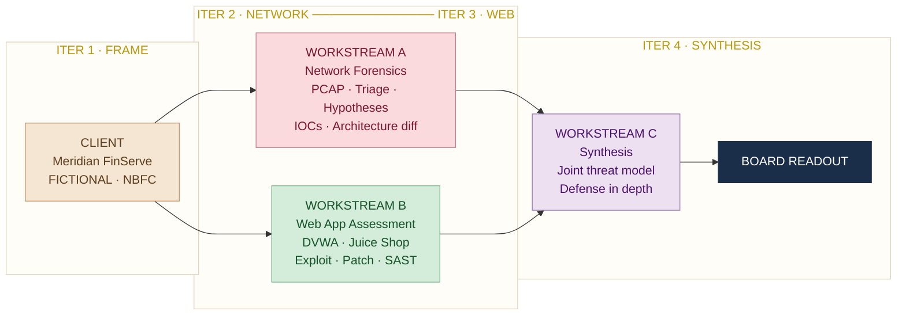

# 🛡️ Project KaVacH: Two-Surface Security Assessment

🎓 **PG Certificate Program — IIT Roorkee × Futurense Technologies**  
Cyber Security Engagement · Cohort 2025 

🔗 **Official Repository:** **[meghainfosec / Kavach\_AI\_Clinic](https://github.com/meghainfosec/Kavach_AI_Clinic)** &nbsp;·&nbsp; 📄 **[Engagement Brief (PDF)](./Project_KAVACH_Sprint_2-3_Engagement_Brief.pdf)**

---

## 00. Overview & Architecture

Project KaVacH is a comprehensive, multi-surface security evaluation combining network forensics and web application security testing. The engagement is modeled against a real-world infrastructure scenario to identify attack vectors, validate architectural flaws, and build unified, data-backed remediation defenses.

### Client Profile

| Field | Detail |
| :--- | :--- |
| **Target Organization** | Meridian FinServe Pvt. Ltd. *(Fictional mid-sized Indian NBFC)* |
| **Operations** | Headquartered in Mumbai · 720 employees · 9 cities · 180,000 borrowers · 22,000 merchants |
| **Core Infrastructure** | Customer-facing lending/EMI portal, partner onboarding portal, branch office flows, public cloud footprints, and co-located data centers |

### Engagement Triggers

1. **Network Anomaly:** Anomalous east-west and outbound traffic flows detected over a 72-hour window inside a historically quiet server segment.
2. **Coordinated Web Disclosure:** Coordinated bug-bounty reporting indicating high-severity vulnerabilities (SQL Injection and IDOR) exposed on the customer application portals.

### The Engagement Architecture

Three workstreams run in parallel and converge into a single board-level readout. Workstreams A and B run from Iteration 2; Workstream C synthesises both in Iteration 4.

*Figure 01 — Three workstreams converge into a single board-level readout*

---

## 01. Engagement Objectives & Scope

The final success criteria mandates that an independent reader can fully reconstruct what was discovered, trace the logical chain of evidence, and deploy identical fixes within 15 minutes.

| Workstream | Scope |
| :--- | :--- |
| **Workstream A — Network Forensics** | 72-hour packet capture triage, hypothesis execution, confidence-scored IOC matrices, and network architecture diffs |
| **Workstream B — Web App Assessment** | Stand up testing environments, demonstrate exploits over a minimum of 5 OWASP Top 10 categories, produce source patches, and review automated SAST report shifts |
| **Workstream C — Synthesis** | Comprehensive cross-surface STRIDE threat model and a multi-layered Defense-in-Depth framework mapping back to specific technical findings |

---

## 02. Team & Responsibility Matrix

| Team Member | Role | Workstream Ownership | LinkedIn |
| :--- | :--- | :--- | :--- |
| **Megha Sharma** | Network Forensics Lead & Web App Co-Lead | **[WS-A: Network Forensics](https://github.com/meghainfosec/Kavach_AI_Clinic/tree/main/1.Network)** ✅ *(Complete)* · **[WS-B: Web App Assessment](https://github.com/meghainfosec/Kavach_AI_Clinic/tree/main/2.Webapp)** *(Co-Owner)* | [🔗 LinkedIn](https://www.linkedin.com/in/megha-sharma-82b5601a/) |
| **Vinay Kumar** | Web Application Security Lead | **[WS-B: Web App Assessment](https://github.com/meghainfosec/Kavach_AI_Clinic/tree/main/2.Webapp)** *(Co-Owner)* | [🔗 LinkedIn](https://www.linkedin.com/in/vinayhereon/) |
| **Kedar Pavaskar** | Threat Modelling Lead | **[WS-C: Synthesis & Threat Modelling](https://github.com/meghainfosec/Kavach_AI_Clinic/tree/main/3.%20Synthesis)** | [🔗 LinkedIn](https://www.linkedin.com/in/kedarpavaskar/) |

---

## 03. Repository Directory Structure

Every deliverable is directly linked below. Click any file to navigate to it in the repository.

- 📄 [README.md](./README.md) — Engagement charter & change log
- 📁 **[1.Network/](https://github.com/meghainfosec/Kavach_AI_Clinic/tree/main/1.Network)** — *Workstream A: Network Forensics*
  - 📁 [A.1 Pcap Selection/](https://github.com/meghainfosec/Kavach_AI_Clinic/tree/main/1.Network/A.1%20Pcap%20Selection)
    - 📁 [1.1 PCAP File/](https://github.com/meghainfosec/Kavach_AI_Clinic/tree/main/1.Network/A.1%20Pcap%20Selection/1.1%20PCAP%20File) — Source capture (Trickbot + Cobalt Strike · 2021-05-26)
    - 📄 [A1-source-pcap selection.md](https://github.com/meghainfosec/Kavach_AI_Clinic/blob/main/1.Network/A.1%20Pcap%20Selection/A1-source-pcap%20selection.md)
  - 📁 [A.2 Triage/](https://github.com/meghainfosec/Kavach_AI_Clinic/tree/main/1.Network/A.2%20Triage)
    - 📄 [1.triage-wireshark.md](https://github.com/meghainfosec/Kavach_AI_Clinic/blob/main/1.Network/A.2%20Triage/1.triage-wireshark.md)
    - 📄 [2.triage-tshark.md](https://github.com/meghainfosec/Kavach_AI_Clinic/blob/main/1.Network/A.2%20Triage/2.%20triage-tshark.md)
    - 📁 [Evidences/](https://github.com/meghainfosec/Kavach_AI_Clinic/tree/main/1.Network/A.2%20Triage/Evidences) — Screenshots
  - 📁 [A.3 Hypothesis-Driven Deep Dive/](https://github.com/meghainfosec/Kavach_AI_Clinic/tree/main/1.Network/A.3%20Hypothesis-Driven%20Deep%20Dive)
    - 📄 [Hypotheses.md](https://github.com/meghainfosec/Kavach_AI_Clinic/blob/main/1.Network/A.3%20Hypothesis-Driven%20Deep%20Dive/Hypotheses.md)
  - 📁 [A.4 Indicator Extraction/](https://github.com/meghainfosec/Kavach_AI_Clinic/tree/main/1.Network/A.4%20Indicator%20Extraction)
    - 📊 [iocs.csv](https://github.com/meghainfosec/Kavach_AI_Clinic/blob/main/1.Network/A.4%20Indicator%20Extraction/iocs.csv) — 16 validated IOCs · 10-column structure
  - 📁 [A.5 Architecture Proposal/](https://github.com/meghainfosec/Kavach_AI_Clinic/tree/main/1.Network/A.5%20Architecture%20Proposal)
    - 📄 [1.before.mermaid](https://github.com/meghainfosec/Kavach_AI_Clinic/blob/main/1.Network/A.5%20Architecture%20Proposal/1.before.mermaid) — Pre-incident network architecture
    - 📄 [2.after.mermaid](https://github.com/meghainfosec/Kavach_AI_Clinic/blob/main/1.Network/A.5%20Architecture%20Proposal/2.after.mermaid) — Hardened network architecture
    - 📄 [3.architecture.md](https://github.com/meghainfosec/Kavach_AI_Clinic/blob/main/1.Network/A.5%20Architecture%20Proposal/3.architecture.md)
    - 🌐 [4.attack-timeline.html](https://github.com/meghainfosec/Kavach_AI_Clinic/blob/main/1.Network/A.5%20Architecture%20Proposal/4.attack-timeline.html) — Interactive attack timeline
  - 📁 **[A6. Extra\_Work/](https://github.com/meghainfosec/Kavach_AI_Clinic/tree/main/1.Network/A6.%20Extra_Work)** — Supplementary analysis & tooling
    - 📁 [1. Data Exfiltration and C2 Beaconing\_Example/](https://github.com/meghainfosec/Kavach_AI_Clinic/tree/main/1.Network/A6.%20Extra_Work/1.%20Data%20Exfiltration%20and%20C2%20Beaconing_Example)
      - 📄 [C2 Beaconing & Data Exfiltration.md](https://github.com/meghainfosec/Kavach_AI_Clinic/blob/main/1.Network/A6.%20Extra_Work/1.%20Data%20Exfiltration%20and%20C2%20Beaconing_Example/C2%20Beaconing%20%26%20Data%20Exfiltration.md)
    - 📁 [2.Data Exfiltration Engine (Application)/](https://github.com/meghainfosec/Kavach_AI_Clinic/tree/main/1.Network/A6.%20Extra_Work/2.Data%20Exfiltration%20Engine%20%28Application%29)
      - 📄 [1. Exfil & C2 Detection Engine.md](https://github.com/meghainfosec/Kavach_AI_Clinic/blob/main/1.Network/A6.%20Extra_Work/2.Data%20Exfiltration%20Engine%20%28Application%29/1.%20Exfil%20%26%20C2%20Detection%20Engine.md)
      - 🐍 [2. Exfil\_C2\_Beaconing\_Detection.py](https://github.com/meghainfosec/Kavach_AI_Clinic/blob/main/1.Network/A6.%20Extra_Work/2.Data%20Exfiltration%20Engine%20%28Application%29/2.%20Exfil_C2_Beaconing_Detection.py)
      - 🖼️ [3. Exfil\_v6\_graph.png](https://github.com/meghainfosec/Kavach_AI_Clinic/blob/main/1.Network/A6.%20Extra_Work/2.Data%20Exfiltration%20Engine%20%28Application%29/3.%20Exfil_v6_graph.png) — Data exfiltration visualisation
  - 📄 **[report.md](https://github.com/meghainfosec/Kavach_AI_Clinic/blob/main/1.Network/report.md)** — **Workstream A Final Report**
- 📁 **[2.Webapp/](https://github.com/meghainfosec/Kavach_AI_Clinic/tree/main/2.Webapp)** — *Workstream B: Web App Assessment*
  - 📁 [B.1 Test Environment/](https://github.com/meghainfosec/Kavach_AI_Clinic/tree/main/2.Webapp/B.1%20Test%20Environment)
    - 📄 [docker-compose.yml](https://github.com/meghainfosec/Kavach_AI_Clinic/blob/main/2.Webapp/B.1%20Test%20Environment/docker-compose.yml) — DVWA (8082) · Juice Shop (3000) · MariaDB
  - 📁 [B.2 Findings/](https://github.com/meghainfosec/Kavach_AI_Clinic/tree/main/2.Webapp/B.2%20Findings) — *5 OWASP Top 10 categories*
    - 📁 [A01 Broken Access Control/](https://github.com/meghainfosec/Kavach_AI_Clinic/tree/main/2.Webapp/B.2%20Findings/A01%20Broken%20Access%20Control)
      - 📄 [A-01 Broken Access Control.md](https://github.com/meghainfosec/Kavach_AI_Clinic/blob/main/2.Webapp/B.2%20Findings/A01%20Broken%20Access%20Control/A-01%20Broken%20Access%20Control.md)
    - 📁 [A02 Cryptographic Failures/](https://github.com/meghainfosec/Kavach_AI_Clinic/tree/main/2.Webapp/B.2%20Findings/A02%20Cryptographic%20Failures)
      - 📄 [1.DVWA Low Level.md](https://github.com/meghainfosec/Kavach_AI_Clinic/blob/main/2.Webapp/B.2%20Findings/A02%20Cryptographic%20Failures/1.DVWA%20Low%20Level.md) — XOR repeating-key cipher
      - 📄 [2.DVWA Medium Level.md](https://github.com/meghainfosec/Kavach_AI_Clinic/blob/main/2.Webapp/B.2%20Findings/A02%20Cryptographic%20Failures/2.DVWA%20Medium%20Level.md) — AES-CBC padding oracle
    - 📁 [A03 Injection/](https://github.com/meghainfosec/Kavach_AI_Clinic/tree/main/2.Webapp/B.2%20Findings/A03%20Injection)
      - 📁 [1.SQL Injection/](https://github.com/meghainfosec/Kavach_AI_Clinic/tree/main/2.Webapp/B.2%20Findings/A03%20Injection/1.SQL%20Injection)
        - 📄 [1.SQL Injection.md](https://github.com/meghainfosec/Kavach_AI_Clinic/blob/main/2.Webapp/B.2%20Findings/A03%20Injection/1.SQL%20Injection/1.SQL%20Injection.md)
      - 📁 [2.XSS\_Reflected/](https://github.com/meghainfosec/Kavach_AI_Clinic/tree/main/2.Webapp/B.2%20Findings/A03%20Injection/2.XSS_Reflected)
        - 📄 [1.Reflected\_XSS.md](https://github.com/meghainfosec/Kavach_AI_Clinic/blob/main/2.Webapp/B.2%20Findings/A03%20Injection/2.XSS_Reflected/1.Reflected_XSS.md)
    - 📁 [A04 Insecure Design/](https://github.com/meghainfosec/Kavach_AI_Clinic/tree/main/2.Webapp/B.2%20Findings/A04%20Insecure%20Design)
      - 📄 [1.A04 Insecure Design Findings.md](https://github.com/meghainfosec/Kavach_AI_Clinic/blob/main/2.Webapp/B.2%20Findings/A04%20Insecure%20Design/1.A04%20Insecure%20Design%20Findings.md)
    - 📁 [A07 Identification and Authentication Failures/](https://github.com/meghainfosec/Kavach_AI_Clinic/tree/main/2.Webapp/B.2%20Findings/A07%20Identification%20and%20Authentication%20Failures)
      - 📄 [1.A07 Identification and Authentication Failures Findings.md](https://github.com/meghainfosec/Kavach_AI_Clinic/blob/main/2.Webapp/B.2%20Findings/A07%20Identification%20and%20Authentication%20Failures/1.A07%20Identification%20and%20Authentication%20Failures%20Findings.md)
  - 📁 [B.3 Attack Path documentation/](https://github.com/meghainfosec/Kavach_AI_Clinic/tree/main/2.Webapp/B.3%20Attack%20Path%20documentation)
    - 📄 [B3\_Attack\_Path\_Documentation.md](https://github.com/meghainfosec/Kavach_AI_Clinic/blob/main/2.Webapp/B.3%20Attack%20Path%20documentation/B3_Attack_Path_Documentation.md)
  - 📁 [B.4 SAST/](https://github.com/meghainfosec/Kavach_AI_Clinic/tree/main/2.Webapp/B.4%20SAST)
    - 📄 [0.before.json](https://github.com/meghainfosec/Kavach_AI_Clinic/blob/main/2.Webapp/B.4%20SAST/0.before.json) — Semgrep baseline · 169 findings
    - 📄 [1.after.json](https://github.com/meghainfosec/Kavach_AI_Clinic/blob/main/2.Webapp/B.4%20SAST/1.after.json) — Post-patch scan
    - 📄 [2.B4 SAST Report.md](https://github.com/meghainfosec/Kavach_AI_Clinic/blob/main/2.Webapp/B.4%20SAST/2.B4%20SAST%20Report.md) — Full SAST analysis report
    - 📁 [per-findings/](https://github.com/meghainfosec/Kavach_AI_Clinic/tree/main/2.Webapp/B.4%20SAST/per-findings) — Before/after JSON per OWASP category
  - 📄 **[report.md](https://github.com/meghainfosec/Kavach_AI_Clinic/blob/main/2.Webapp/report.md)** — **Workstream B Final Report**
- 📁 **[3. Synthesis/](https://github.com/meghainfosec/Kavach_AI_Clinic/tree/main/3.%20Synthesis)** — *Workstream C: Joint Threat Model*
  - 📁 [C.1 Joint Threat Model/](https://github.com/meghainfosec/Kavach_AI_Clinic/tree/main/3.%20Synthesis/C.1%20Joint%20Threat%20Model)
    - 📄 [1.threat-model.md](https://github.com/meghainfosec/Kavach_AI_Clinic/blob/main/3.%20Synthesis/C.1%20Joint%20Threat%20Model/1.threat-model.md) — STRIDE model (KAVACH-WC-TM-001)
    - 📄 [1a.Attack\_Chain\_1.md](https://github.com/meghainfosec/Kavach_AI_Clinic/blob/main/3.%20Synthesis/C.1%20Joint%20Threat%20Model/1a.Attack_Chain_1.md) — Network Pivot via Web Compromise
    - 📄 [1b.Attack\_Chain\_2.md](https://github.com/meghainfosec/Kavach_AI_Clinic/blob/main/3.%20Synthesis/C.1%20Joint%20Threat%20Model/1b.Attack_Chain_2.md) — SQLi Enables Lateral Movement
    - 📄 [1c.Attack\_Chain\_3.md](https://github.com/meghainfosec/Kavach_AI_Clinic/blob/main/3.%20Synthesis/C.1%20Joint%20Threat%20Model/1c.Attack_Chain_3.md) — Parallel Siege
  - 📁 [C.2 defense in depth proposal/](https://github.com/meghainfosec/Kavach_AI_Clinic/tree/main/3.%20Synthesis/C.2%20defense%20in%20depth%20proposal)
    - 📄 [1.defence\_in\_depth.md](https://github.com/meghainfosec/Kavach_AI_Clinic/blob/main/3.%20Synthesis/C.2%20defense%20in%20depth%20proposal/1.defence_in_depth.md) — KAVACH-WC-C2-001
    - 📄 [2..Timeline.md](https://github.com/meghainfosec/Kavach_AI_Clinic/blob/main/3.%20Synthesis/C.2%20defense%20in%20depth%20proposal/2..Timeline.md)
  - 📁 [C.3 Executive Readout/](https://github.com/meghainfosec/Kavach_AI_Clinic/tree/main/3.%20Synthesis/C.3%20Executive%20Readout)
    - 📄 [Executive\_readout.pdf](https://github.com/meghainfosec/Kavach_AI_Clinic/blob/main/3.%20Synthesis/C.3%20Executive%20Readout/Executive_readout.pdf) — Board-level summary
- 📁 **[4. Prompts/](https://github.com/meghainfosec/Kavach_AI_Clinic/tree/main/4.%20Prompts)** — *LLM Interaction Logs (per team member)*
  - 📄 [1.megha\_logs.md](https://github.com/meghainfosec/Kavach_AI_Clinic/blob/main/4.%20Prompts/1.megha_logs.md) — Workstream A · Network Forensics prompts
  - 📄 [2\_vinay\_logs.md](https://github.com/meghainfosec/Kavach_AI_Clinic/blob/main/4.%20Prompts/2_vinay_logs.md) — Workstream B · Web App prompts
  - 📄 [3\_kedar\_logs.md](https://github.com/meghainfosec/Kavach_AI_Clinic/blob/main/4.%20Prompts/3_kedar_logs.md) — Workstream C · Synthesis prompts
- 📁 **[5. Reflections/](https://github.com/meghainfosec/Kavach_AI_Clinic/tree/main/5.%20Reflections)**
  - 📁 [1.Questions/](https://github.com/meghainfosec/Kavach_AI_Clinic/tree/main/5.%20Reflections/1.Questions) — [Q1](https://github.com/meghainfosec/Kavach_AI_Clinic/blob/main/5.%20Reflections/1.Questions/1.Question_1.md) · [Q2](https://github.com/meghainfosec/Kavach_AI_Clinic/blob/main/5.%20Reflections/1.Questions/2.Question_2.md) · [Q3](https://github.com/meghainfosec/Kavach_AI_Clinic/blob/main/5.%20Reflections/1.Questions/3.Question_3.md) · [Q4](https://github.com/meghainfosec/Kavach_AI_Clinic/blob/main/5.%20Reflections/1.Questions/4.Question_4.md) · [Q5](https://github.com/meghainfosec/Kavach_AI_Clinic/blob/main/5.%20Reflections/1.Questions/5.Question_5.md) · [Q6](https://github.com/meghainfosec/Kavach_AI_Clinic/blob/main/5.%20Reflections/1.Questions/6.Question_6.md) · [Q7](https://github.com/meghainfosec/Kavach_AI_Clinic/blob/main/5.%20Reflections/1.Questions/7.Question_7.md) · [Q8](https://github.com/meghainfosec/Kavach_AI_Clinic/blob/main/5.%20Reflections/1.Questions/8.Question_8.md)
  - 📄 [Reflections.md](https://github.com/meghainfosec/Kavach_AI_Clinic/blob/main/5.%20Reflections/Reflections.md) — Post-engagement reflections
- 📁 **[6. Retro/](https://github.com/meghainfosec/Kavach_AI_Clinic/tree/main/6.%20Retro)**
  - 📄 [1.Retrospective.md](https://github.com/meghainfosec/Kavach_AI_Clinic/blob/main/6.%20Retro/1.Retrospective.md) — Keep · Stop · Start

---

## 04. Tooling Matrix

> All tools operate entirely under local hardware constraints using open-source utilities. Primary analyst OS: Kali Linux 2026.1 (VirtualBox).

| Security Phase | Tools Used | Purpose |
| :--- | :--- | :--- |
| **Operating Environment** | Kali Linux, VirtualBox | Primary attacker/analyst OS · isolated lab environment |
| **Code Editing & Lab Management** | VS Code, Docker | Source code review, file management, and containerised lab orchestration |
| **Packet Capture Triage** | Wireshark, tshark, Zeek | PCAP analysis, protocol dissection, and network traffic parsing |
| **Vulnerability Target Interfaces** | DVWA, OWASP Juice Shop | Local target replication hosted entirely via Docker |
| **Interception & Probing** | Burp Suite Community, curl | Web request interception, proxy modification, and manual injection testing |
| **Static Analysis** | Semgrep CE 1.163.0 | Detection of hardcoded flaws and insecure code paths via static review |
| **Encoding & Crypto Analysis** | CyberChef | Decoding, encoding, hash analysis, and cryptographic challenge solving |
| **Modeling & Visualization** | Mermaid, Draw.io | Generating architecture diagrams, before-vs-after diffs, and timeline layouts |
| **AI-Assisted Analysis** | MCP Server (GitHub Copilot), Claude | LLM-assisted forensic analysis, code generation, and threat modelling prompts |

---

## 05. Unified Project Agile Timeline

**Execution flows across 4 milestones bound to clear system exit parameters:**

| Iteration | Phase | Exit Criteria |
| :---: | :--- | :--- |
| 1 | **Frame** | Charter freeze, environment replication verified under 15 minutes, target PCAP validation |
| 2 | **Network** | TShark session filtering completed, structured IOC list generated, network segment mapping |
| 3 | **Web** | Full execution of exploit proofs, SAST metrics captured, source code patch remediation |
| 4 | **Synthesize** | Convergence into a single board readout, structural threat dependencies defined, retrospectives held |

---

> *Proprietary engagement framework created by Futurense AI Clinic in collaboration with IIT Roorkee × Futurense Technologies.*
